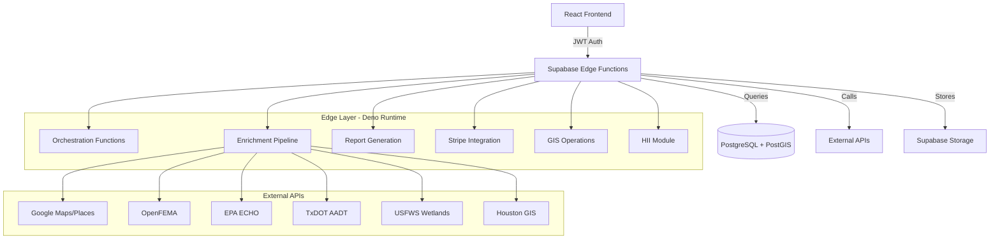
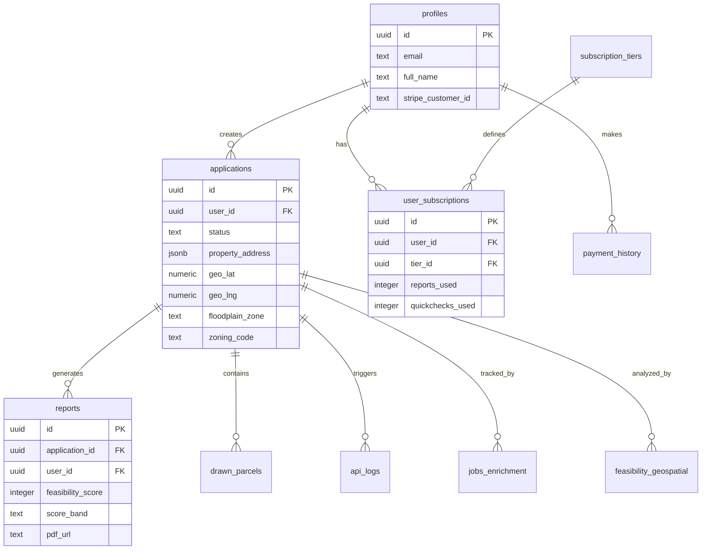
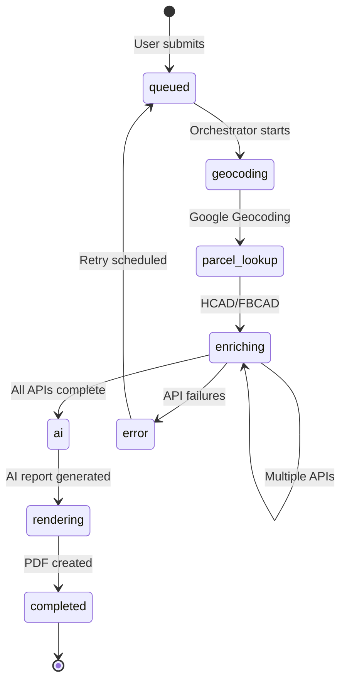

# SiteIntel™ Backend Documentation Index

**Complete reference for backend architecture, edge functions, database, and integrations.**

*Last Updated: 2025-01-26*

---

## 📋 Quick Navigation

| Section | Description |
|---------|-------------|
| [Architecture Overview](#architecture-overview) | High-level system architecture and tech stack |
| [Edge Functions Reference](#edge-functions-reference) | Complete catalog of 53+ edge functions |
| [Database Schema](#database-schema) | PostgreSQL + PostGIS table structure |
| [API Integrations](#api-integrations) | External data sources and providers |
| [Data Flow Pipelines](#data-flow-pipelines) | Application lifecycle and enrichment flow |
| [Security & Authentication](#security--authentication) | JWT, RLS, and security policies |
| [HII Module](#hii-module-hospitality-intelligence) | Hospitality Intelligence backend |
| [Schemas & Specifications](#schemas--specifications) | OpenAPI and JSON schemas |
| [Quick Reference](#quick-reference) | Environment variables, error codes, rate limits |
| [Related Documentation](#related-documentation) | All backend-related docs |

---

## 🏗️ Architecture Overview

### System Architecture



### Tech Stack

| Component | Technology | Purpose |
|-----------|-----------|---------|
| **Runtime** | Deno | Edge function execution environment |
| **Database** | PostgreSQL 15 | Primary data store |
| **Spatial** | PostGIS 3.x | Geospatial operations and queries |
| **Auth** | Supabase Auth | JWT-based authentication |
| **Storage** | Supabase Storage | PDF and asset storage |
| **Payments** | Stripe | Subscription and payment processing |
| **AI** | OpenAI GPT-4 | Report narrative generation |

### Key Architecture Documents

- **[Architecture Overview](./architecture/OVERVIEW.md)** - Complete system architecture
- **[Data Flow](./architecture/data-flow.md)** - Application lifecycle and pipelines
- **[Geospatial Integration](./architecture/GEOSPATIAL_INTEGRATION.md)** - GIS architecture
- **[GIS Spatial Logic](./architecture/GIS_SPATIAL_LOGIC.md)** - Spatial analysis implementation
- **[AI Pipeline Blueprint](./architecture/AI_PIPELINE_BLUEPRINT.md)** - AI report generation

---

## ⚡ Edge Functions Reference

**53 Supabase Edge Functions** organized by category. All functions run on Deno runtime.

### 📊 Orchestration (3 functions)

| Function | Auth | Purpose |
|----------|------|---------|
| `orchestrate-application` | ✅ Yes | Main orchestrator - coordinates full enrichment pipeline |
| `submit-application` | ✅ Yes | Creates new application and triggers processing |
| `cron-enrichment` | 🔒 Service | Background job for scheduled enrichment queue processing |

### 🔄 Data Enrichment (12 functions)

| Function | Auth | Purpose |
|----------|------|---------|
| `enrich-application` | 🔒 Internal | Legacy enrichment coordinator (deprecated) |
| `enrich-feasibility` | 🔒 Internal | Main enrichment orchestrator for parcel data |
| `enrich-utilities` | 🔒 Internal | Fetches utility infrastructure from city GIS |
| `enrich-utilities-osm` | 🔒 Internal | OpenStreetMap utility fallback |
| `enrich-wetlands` | 🔒 Internal | USFWS National Wetlands Inventory query |
| `enrich-epa-echo` | 🔒 Internal | EPA facility proximity search (1-mile radius) |
| `fetch-hcad-parcels` | 🔒 Internal | Harris County Appraisal District parcel data |
| `fetch-places-context` | 🔒 Internal | Google Places nearby context (restaurants, retail, etc.) |
| `fetch-drivetimes` | 🔒 Internal | Isochrone drivetime polygons |
| `fetch-elevation` | 🔒 Internal | Elevation data for coordinates |
| `query-fema-by-point` | 🔒 Internal | FEMA flood zone point query |
| `bulk-re-enrich` | ✅ Admin | Re-enriches multiple applications in batch |

### 📄 Report Generation (4 functions)

| Function | Auth | Purpose |
|----------|------|---------|
| `generate-ai-report` | ✅ Yes | Generates AI narrative content for reports |
| `generate-pdf` | ✅ Yes | Renders PDF report from application data |
| `generate-quick-check` | ✅ Yes | Creates free QuickCheck analysis |
| `get-sanitized-report` | ✅ Yes | Returns sanitized report data (no PII) |

### 💳 Payment & Subscription (6 functions)

| Function | Auth | Purpose |
|----------|------|---------|
| `create-checkout-session` | ✅ Yes | Creates Stripe checkout session |
| `create-subscription` | ✅ Yes | Creates new subscription |
| `stripe-webhook` | 🌐 Public | Handles Stripe webhook events (signature verified) |
| `customer-portal` | ✅ Yes | Generates Stripe customer portal URL |
| `get-credits` | ✅ Yes | Returns user's current credit balance |
| `use-credit` | ✅ Yes | Deducts credit for report generation |
| `check-subscription` | ✅ Yes | Validates subscription status |

### 🗺️ GIS & Geospatial (6 functions)

| Function | Auth | Purpose |
|----------|------|---------|
| `gis-fetch-with-versioning` | 🔒 Internal | Fetches GIS layers with version tracking |
| `gis-get-layer` | ✅ Yes | Retrieves specific GIS layer data |
| `gis-migrate-legacy-data` | 🔒 Admin | Migrates legacy geospatial data |
| `gis-refresh-scheduler` | 🔒 Service | Scheduled GIS data refresh job |
| `validate-gis-endpoints` | 🔒 Admin | Health check for GIS API endpoints |
| `compute-geospatial-score` | 🔒 Internal | Calculates geospatial feasibility score |

### 🏨 HII Module - Hospitality Intelligence (4 functions)

| Function | Auth | Purpose |
|----------|------|---------|
| `hii-score` | ✅ Yes | Calculates Hospitality Investment Index score |
| `hii-geojson` | ✅ Yes | Returns GeoJSON for HII visualization |
| `hii-ingest` | 🔒 Admin | Ingests beverage sales data for HII |
| `hii-alerts` | ✅ Yes | Returns HII alerts and opportunities |

**HII Module Documentation:** [backend/README.md](../backend/README.md)

### 📍 Parcel Management (4 functions)

| Function | Auth | Purpose |
|----------|------|---------|
| `save-drawn-parcel` | ✅ Yes | Saves user-drawn parcel polygon |
| `update-drawn-parcel` | ✅ Yes | Updates existing drawn parcel |
| `delete-drawn-parcel` | ✅ Yes | Deletes drawn parcel |
| `fetch-geospatial-layers` | ✅ Yes | Fetches multiple geospatial layers for map |

### 🛠️ Utility & Helper Functions (14 functions)

| Function | Auth | Purpose |
|----------|------|---------|
| `geocode-intersection` | ✅ Yes | Geocodes address using Google Geocoding API |
| `google-places` | ✅ Yes | Google Places API autocomplete |
| `google-place-details` | ✅ Yes | Detailed place information |
| `render-static-map` | ✅ Yes | Generates Google Static Maps image URL |
| `render-streetview` | ✅ Yes | Generates Street View image URL |
| `utility-proxy` | 🔒 Internal | Proxy for city utility API calls |
| `save-draft` | ✅ Yes | Saves draft application |
| `re-enrich-application` | ✅ Admin | Re-runs enrichment for single application |
| `chat-with-report` | ✅ Yes | AI chat assistant for report questions |
| `check-feature-flag` | ✅ Yes | Feature flag lookup |
| `v2_health_check` | 🌐 Public | Health check endpoint |
| `submit-beta-signup` | 🌐 Public | Beta signup form submission |

**Legend:**
- ✅ **Yes**: Requires JWT authentication
- 🔒 **Internal/Admin**: Requires service role or admin role
- 🌐 **Public**: No authentication required (`verify_jwt = false`)

### Full Edge Function Documentation

**[→ Complete Edge Functions Reference](./api/edge-functions.md)** - Detailed specs, request/response schemas, error codes

---

## 💾 Database Schema

### Core Tables

| Table | Purpose | RLS Enabled |
|-------|---------|-------------|
| **applications** | Main feasibility application records | ✅ User-scoped |
| **reports** | Generated AI reports and PDFs | ✅ User-scoped |
| **profiles** | User profile information | ✅ User-scoped |
| **user_subscriptions** | Subscription tier and credit tracking | ✅ User-scoped |
| **payment_history** | Stripe payment records | ✅ User-scoped |
| **drawn_parcels** | User-drawn parcel geometries (PostGIS) | ✅ User-scoped |
| **api_logs** | External API call logging | ✅ Admin-only |
| **jobs_enrichment** | Enrichment job history | ✅ Admin-only |

### Geospatial Tables (PostGIS)

| Table | Purpose | Geometry Type |
|-------|---------|---------------|
| **fema_flood_zones** | Cached FEMA flood polygons | Polygon |
| **txdot_traffic_segments** | TxDOT AADT traffic segments | LineString |
| **county_boundaries** | Texas county boundaries | Polygon |
| **drawn_parcels** | User-drawn parcel polygons | Polygon |
| **feasibility_geospatial** | Geospatial analysis results | Point + JSONB |

### Entity Relationship Diagram



### Full Database Documentation

**[→ Complete Database Schema Reference](./architecture/database-schema.md)** - Full table specs, indexes, triggers, functions

---

## 🔌 API Integrations

### External Data Sources

| Provider | Purpose | Data Retrieved | Endpoint Documentation |
|----------|---------|----------------|------------------------|
| **Google Geocoding** | Address geocoding | lat/lng, formatted_address, place_id | [Google Maps Platform](https://developers.google.com/maps/documentation/geocoding) |
| **Google Places** | Nearby context | Places within radius, categories | [Places API](https://developers.google.com/maps/documentation/places) |
| **Google Static Maps** | Map imagery | Static map images with overlays | [Static Maps API](https://developers.google.com/maps/documentation/maps-static) |
| **HCAD (Harris County)** | Parcel data | Owner, acreage, valuation, zoning | ArcGIS FeatureServer |
| **FBCAD (Fort Bend)** | Parcel data | Owner, acreage, valuation | ArcGIS FeatureServer |
| **OpenFEMA** | Flood risk | NFIP claims, flood zones, disasters | [OpenFEMA API](https://www.fema.gov/about/openfema/api) |
| **EPA ECHO** | Environmental compliance | Facility proximity (1-mile radius) | [ECHO Web Services](https://echo.epa.gov/tools/web-services) |
| **TxDOT** | Traffic data | AADT counts, roadway segments | ArcGIS FeatureServer |
| **USFWS Wetlands** | Wetlands overlay | NWI polygons, wetland types | [NWI REST Service](https://www.fws.gov/wetlands/data/web-services.html) |
| **Houston GIS** | Utilities | Water, sewer, storm, force mains | ArcGIS MapServer |
| **Census Bureau** | Demographics | Population, income, households | Census API |
| **OpenStreetMap** | Utilities fallback | OSM utility nodes/ways | Overpass API |

### API Integration Guides

- **[API Integrations Overview](./api/INTEGRATIONS.md)** - Integration architecture and patterns
- **[Integration Field Mapping](./api/INTEGRATION_MAPPING.md)** - Database field mappings per API
- **[External Integrations Reference](./api/external-integrations.md)** - Detailed endpoint specs

---

## 🔄 Data Flow Pipelines

### Application Lifecycle State Machine



### Main Enrichment Pipeline

**Orchestrator:** `orchestrate-application`

1. **Geocoding** (`geocode-intersection`)
   - Input: Address string
   - Output: lat/lng, place_id, formatted_address

2. **Parcel Lookup** (`fetch-hcad-parcels`)
   - Input: lat/lng
   - Output: parcel_id, owner, acreage, valuation

3. **Parallel Enrichment** (8 concurrent calls)
   - `query-fema-by-point` - Flood zone
   - `enrich-utilities` - Water/sewer/storm
   - `enrich-wetlands` - USFWS wetlands
   - `enrich-epa-echo` - EPA facilities
   - `fetch-places-context` - Nearby places
   - `fetch-drivetimes` - Isochrones
   - `fetch-elevation` - Elevation data
   - TxDOT AADT - Traffic counts

4. **AI Generation** (`generate-ai-report`)
   - Input: All enriched data
   - Output: Narrative report sections, feasibility_score

5. **PDF Rendering** (`generate-pdf`)
   - Input: AI report + enriched data
   - Output: PDF URL in Supabase Storage

### Status Codes

| Status | Description | Next Action |
|--------|-------------|-------------|
| `queued` | Awaiting processing | Orchestrator picks up |
| `geocoding` | Geocoding address | → `parcel_lookup` |
| `parcel_lookup` | Fetching parcel data | → `enriching` |
| `enriching` | Running enrichment APIs | → `ai` |
| `ai` | Generating AI report | → `rendering` |
| `rendering` | Creating PDF | → `completed` |
| `completed` | Report ready | User downloads |
| `error` | Pipeline failed | Retry with backoff |

### Full Data Flow Documentation

**[→ Complete Data Flow Reference](./architecture/data-flow.md)** - Detailed pipeline specs, error handling, retry logic

---

## 🔒 Security & Authentication

### Authentication Model

- **JWT Tokens**: Supabase Auth issues JWTs on login
- **Edge Function Auth**: Most functions require `Authorization: Bearer <token>`
- **Service Role**: Certain functions use service role key for elevated permissions
- **Public Functions**: Webhook endpoints and health checks have `verify_jwt = false`

### Row-Level Security (RLS)

All user-scoped tables have RLS policies:

```sql
-- Example: Applications table RLS
CREATE POLICY "Users can view own applications" 
ON applications FOR SELECT 
USING (auth.uid() = user_id);

CREATE POLICY "Admins can view all applications" 
ON applications FOR SELECT 
USING (has_role(auth.uid(), 'admin'::app_role));
```

### User Roles

| Role | Permissions | Tables |
|------|-------------|--------|
| `user` | Own data only | applications, reports, drawn_parcels |
| `admin` | All data + admin operations | All tables + api_logs, jobs_enrichment |

### Security Best Practices

- **Input Validation**: All user inputs validated and sanitized
- **SQL Injection Prevention**: Supabase client (no raw SQL in edge functions)
- **XSS Prevention**: DOMPurify on frontend, sanitized outputs
- **Rate Limiting**: 100 req/min standard, 30 req/min enrichment, 10 req/min AI
- **HTTPS/TLS**: All API calls encrypted in transit

### Security Documentation

- **[Security Overview](./security/SECURITY_OVERVIEW.md)** - Complete security architecture
- **[RLS Policies Reference](./security/rls-policies.md)** - All RLS policies documented

---

## 🏨 HII Module (Hospitality Intelligence)

### Overview

The Hospitality Intelligence Index (HII) backend module provides location-based hospitality investment scoring using Texas beverage sales data (TABC).

### Architecture

```
backend/
├── README.md                    # HII module documentation
├── migrations/
│   ├── 001_init_tx_beverage.sql    # tx_beverage_sales table
│   ├── 002_fn_hii.sql              # fn_compute_hii() function
│   ├── 003_hii_alerts.sql          # hii_alerts table
│   └── 004_enable_rls_all_tables.sql
├── services/
│   └── hii-service.ts              # TypeScript HII service
└── setup.sh                        # Database setup script
```

### Edge Functions

- **`hii-score`**: Computes HII score for location (0-100)
- **`hii-geojson`**: Returns GeoJSON for map visualization
- **`hii-ingest`**: Admin function to ingest TABC data
- **`hii-alerts`**: Returns investment alerts and opportunities

### Database Schema

**Table: `tx_beverage_sales`**
- Stores TABC sales data with PostGIS geometry
- Indexed by location, category, year
- 500K+ records covering Texas

**Function: `fn_compute_hii(lat, lng, radius_mi)`**
- Aggregates sales within radius
- Computes growth trends
- Returns normalized 0-100 score

### HII Documentation

**[→ HII Module README](../backend/README.md)** - Complete HII documentation, data sources, API reference

---

## 📋 Schemas & Specifications

### OpenAPI Specification

**[OpenAPI 3.0 Specification](./api/openapi.yaml)** - REST API contract

```yaml
openapi: 3.0.0
info:
  title: SiteIntel Feasibility API
  version: 1.0.0
  description: Commercial real estate feasibility analysis
paths:
  /functions/v1/submit-application:
    post:
      summary: Submit new feasibility application
      # ... full spec in file
```

### JSON Schemas

- **[Application Schema](./api/schema.json)** - Application data model
- **[Geospatial Layers Schema](./api/geospatial_layers.schema.json)** - GIS layer definitions

### Usage

```typescript
// Validate application data against schema
import schema from './docs/api/schema.json';
import Ajv from 'ajv';

const ajv = new Ajv();
const validate = ajv.compile(schema);
const valid = validate(applicationData);
```

---

## 📖 Quick Reference

### Environment Variables

**Required in Edge Functions:**

```bash
# Supabase
SUPABASE_URL=https://mcmfwlgovubpdcfiqfvk.supabase.co
SUPABASE_ANON_KEY=eyJhbGciOiJIUzI1NiIsInR5cCI6IkpXVCJ9...
SUPABASE_SERVICE_ROLE_KEY=<service-role-key>

# Google APIs
GOOGLE_MAPS_API_KEY=<google-api-key>

# OpenAI
OPENAI_API_KEY=<openai-api-key>

# Stripe
STRIPE_SECRET_KEY=sk_live_...
STRIPE_WEBHOOK_SECRET=whsec_...
```

### Common Error Codes

| Code | HTTP | Description | Resolution |
|------|------|-------------|------------|
| `UNAUTHORIZED` | 401 | Missing/invalid JWT | Refresh token, re-authenticate |
| `FORBIDDEN` | 403 | Insufficient permissions | Check user role, subscription tier |
| `NOT_FOUND` | 404 | Resource not found | Verify application/report ID |
| `VALIDATION_ERROR` | 400 | Invalid input data | Check request body, query params |
| `EXTERNAL_API_ERROR` | 502 | External API failure | Retry, check API status |
| `INTERNAL_ERROR` | 500 | Server error | Check logs, contact support |

### Rate Limits

| Function Type | Limit | Window |
|---------------|-------|--------|
| Standard functions | 100 requests | 1 minute |
| Enrichment functions | 30 requests | 1 minute |
| AI functions | 10 requests | 1 minute |
| Webhooks | Unlimited | N/A |

### Database Limits

- **Max connections**: 60 (Supabase free tier)
- **Statement timeout**: 60 seconds
- **Max row size**: 1 GB (PostGIS geometries)
- **Max JSON size**: 1 GB (jsonb columns)

---

## 📚 Related Documentation

### Architecture & Design

- **[Architecture Overview](./architecture/OVERVIEW.md)** - System architecture, components, tech stack
- **[Data Flow](./architecture/data-flow.md)** - Application lifecycle, enrichment pipeline
- **[Geospatial Integration](./architecture/GEOSPATIAL_INTEGRATION.md)** - GIS architecture, PostGIS usage
- **[GIS Spatial Logic](./architecture/GIS_SPATIAL_LOGIC.md)** - Spatial queries, geometry operations
- **[AI Pipeline Blueprint](./architecture/AI_PIPELINE_BLUEPRINT.md)** - AI report generation, prompt engineering
- **[Database Schema](./architecture/database-schema.md)** - Complete table reference, indexes, triggers

### API Documentation

- **[Edge Functions Reference](./api/edge-functions.md)** - All 53 edge functions with specs
- **[API Integrations](./api/INTEGRATIONS.md)** - External API integration patterns
- **[Integration Field Mapping](./api/INTEGRATION_MAPPING.md)** - Database field mappings per API
- **[External Integrations](./api/external-integrations.md)** - Detailed endpoint specifications
- **[OpenAPI Specification](./api/openapi.yaml)** - REST API contract (OpenAPI 3.0)
- **[Application Schema](./api/schema.json)** - Application data model JSON Schema
- **[Geospatial Layers Schema](./api/geospatial_layers.schema.json)** - GIS layer definitions

### Features

- **[PDF Generation](./features/PDF_GENERATION.md)** - PDF rendering implementation
- **[Report Generation](./features/REPORT_GENERATION.md)** - Report generation workflow

### Security

- **[Security Overview](./security/SECURITY_OVERVIEW.md)** - Security architecture, threat model
- **[RLS Policies](./security/rls-policies.md)** - Row-Level Security policies reference

### HII Module

- **[HII Backend README](../backend/README.md)** - Hospitality Intelligence module documentation
- **[HII Migrations](../backend/migrations/)** - Database migration files
- **[HII Service](../backend/services/hii-service.ts)** - TypeScript service implementation

### Testing & Operations

- **[Houston API Test Commands](../docs/HOUSTON_API_TEST_COMMANDS.md)** - API testing examples
- **[Environment Setup](./guides/environment-setup.md)** - Local development setup
- **[Deployment Guide](./guides/deployment.md)** - Deployment procedures

---

## 🔗 External Resources

- **[Supabase Documentation](https://supabase.com/docs)** - Supabase platform docs
- **[PostGIS Reference](https://postgis.net/documentation/)** - PostGIS spatial functions
- **[Deno Manual](https://deno.land/manual)** - Deno runtime documentation
- **[Stripe API Reference](https://stripe.com/docs/api)** - Stripe payment integration
- **[OpenAI API Reference](https://platform.openai.com/docs/api-reference)** - OpenAI GPT models

---

## 📝 Contributing to Backend

### Adding New Edge Functions

1. Create function in `supabase/functions/<function-name>/index.ts`
2. Add CORS headers (see existing functions)
3. Add JWT auth if required
4. Update `supabase/config.toml` if public (`verify_jwt = false`)
5. Document in [edge-functions.md](./api/edge-functions.md)
6. Update this index

### Database Migrations

1. Create migration file in `supabase/migrations/`
2. Use format: `YYYYMMDDHHMMSS_description.sql`
3. Include rollback instructions in comments
4. Test locally before deploying
5. Document schema changes in [database-schema.md](./architecture/database-schema.md)

### API Integration Checklist

- [ ] Add endpoint to [external-integrations.md](./api/external-integrations.md)
- [ ] Map fields in [INTEGRATION_MAPPING.md](./api/INTEGRATION_MAPPING.md)
- [ ] Add error handling and retries
- [ ] Implement caching strategy
- [ ] Add API logging to `api_logs` table
- [ ] Update enrichment pipeline if needed

---

## 📞 Support & Contact

- **Documentation Issues**: Open GitHub issue with `docs` label
- **Backend Bugs**: Open GitHub issue with `backend` label
- **Security Issues**: Email security@siteintel.ai (do not open public issues)

---

*This index is maintained as part of the SiteIntel™ documentation structure. Last updated: 2025-01-26*
