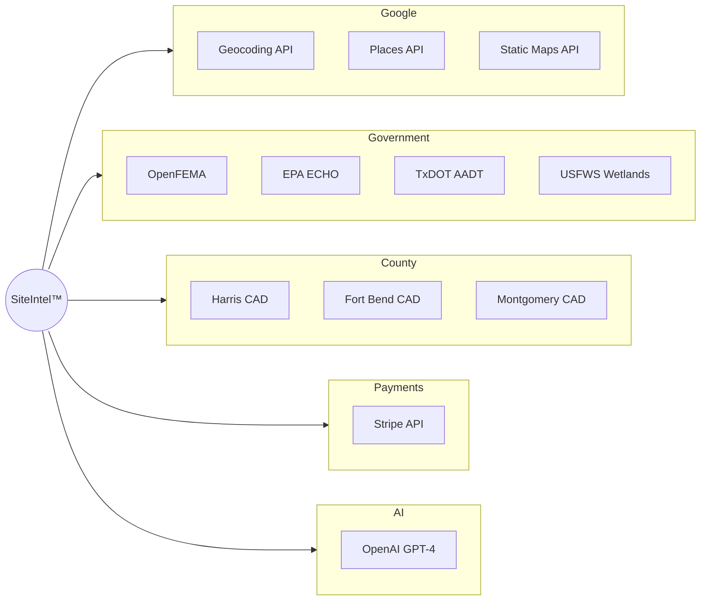
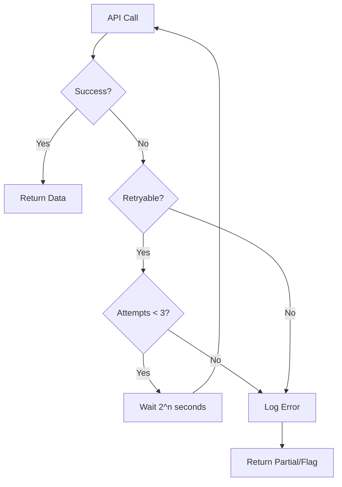

# External API Integrations

Documentation for all external APIs integrated with SiteIntel™ Feasibility.

## Overview

SiteIntel™ integrates with multiple external data sources to provide comprehensive feasibility analysis.



## Google APIs

### Geocoding API

Converts addresses to coordinates.

| Property | Value |
|----------|-------|
| **Base URL** | `https://maps.googleapis.com/maps/api/geocode/json` |
| **Auth** | API Key |
| **Rate Limit** | 50 QPS |

**Example Request:**
```bash
GET /geocode/json?address=123+Main+St,Houston,TX&key=API_KEY
```

**Example Response:**
```json
{
  "results": [{
    "formatted_address": "123 Main St, Houston, TX 77001",
    "geometry": {
      "location": {
        "lat": 29.7604,
        "lng": -95.3698
      }
    },
    "place_id": "ChIJ..."
  }],
  "status": "OK"
}
```

### Places API

Fetches nearby points of interest.

| Property | Value |
|----------|-------|
| **Base URL** | `https://places.googleapis.com/v1/places:searchNearby` |
| **Auth** | API Key |
| **Rate Limit** | 100 QPS |

### Static Maps API

Generates map images for reports.

| Property | Value |
|----------|-------|
| **Base URL** | `https://maps.googleapis.com/maps/api/staticmap` |
| **Auth** | API Key |
| **Rate Limit** | 100 QPS |

**Example URL:**
```
https://maps.googleapis.com/maps/api/staticmap
  ?center=29.7604,-95.3698
  &zoom=16
  &size=600x400
  &maptype=hybrid
  &key=API_KEY
```

---

## OpenFEMA

### NFIP Claims API

Historical flood insurance claims data.

| Property | Value |
|----------|-------|
| **Base URL** | `https://www.fema.gov/api/open/v2/FimaNfipClaims` |
| **Auth** | None (public) |
| **Format** | OData v4 |

**Example Request:**
```bash
GET /v2/FimaNfipClaims
  ?$filter=state eq 'TX' and county eq 'HARRIS'
  &$select=yearOfLoss,amountPaid
  &$top=1000
```

### Disaster Declarations API

Federal disaster declarations by location.

| Property | Value |
|----------|-------|
| **Base URL** | `https://www.fema.gov/api/open/v2/DisasterDeclarationsSummaries` |
| **Auth** | None (public) |

---

## County Appraisal Districts

### Harris County (HCAD)

| Property | Value |
|----------|-------|
| **Base URL** | `https://www.gis.hctx.net/arcgis/rest/services/HCAD/Parcels/MapServer/0` |
| **Auth** | None (public) |
| **Format** | ArcGIS REST |

**Example Query:**
```bash
POST /query
  ?geometry=-95.3698,29.7604
  &geometryType=esriGeometryPoint
  &spatialRel=esriSpatialRelWithin
  &outFields=owner_name_1,acreage_1,tot_market_val
  &returnGeometry=true
  &f=json
```

**Response Fields:**
| Field | Description |
|-------|-------------|
| `owner_name_1` | Property owner name |
| `acreage_1` | Parcel acreage |
| `tot_market_val` | Total market value |
| `land_val` | Land value |
| `imprv_val` | Improvement value |

### Fort Bend County (FBCAD)

| Property | Value |
|----------|-------|
| **Base URL** | `https://gisweb.fbcad.org/arcgis/rest/services/Hosted/FBCAD_Public_Data/FeatureServer/0` |
| **Auth** | None (public) |
| **Format** | ArcGIS REST |

### Montgomery County (MCAD)

| Property | Value |
|----------|-------|
| **Base URL** | `https://gis.mctx.org/arcgis/rest/services/` |
| **Auth** | None (public) |
| **Format** | ArcGIS REST |

---

## EPA ECHO

Environmental compliance facility search.

| Property | Value |
|----------|-------|
| **Base URL** | `https://echo.epa.gov/tools/web-services/facility-search` |
| **Auth** | None (public) |
| **Format** | JSON, XML |

**Example Request:**
```bash
GET /facility-search
  ?output=JSON
  &p_lat=29.7604
  &p_long=-95.3698
  &p_radius=1
```

**Response Fields:**
| Field | Description |
|-------|-------------|
| `FacilityName` | Facility name |
| `FacilityLat` | Latitude |
| `FacilityLong` | Longitude |
| `Distance` | Distance in miles |
| `Programs` | Regulatory programs |

---

## USFWS National Wetlands Inventory

| Property | Value |
|----------|-------|
| **Base URL** | `https://fwspublicservices.wim.usgs.gov/wetlandsmapservice/rest/services/Wetlands/MapServer/0` |
| **Auth** | None (public) |
| **Format** | ArcGIS REST |

**Example Query:**
```bash
POST /query
  ?geometry={polygon_geojson}
  &geometryType=esriGeometryPolygon
  &spatialRel=esriSpatialRelIntersects
  &outFields=ATTRIBUTE,WETLAND_TYPE
  &f=json
```

---

## TxDOT AADT

Texas traffic count data.

| Property | Value |
|----------|-------|
| **Base URL** | `https://services.arcgis.com/.../AADT/FeatureServer/0` |
| **Auth** | None (public) |
| **Format** | ArcGIS REST |

**Response Fields:**
| Field | Description |
|-------|-------------|
| `TRFC_STATN_ID` | Station ID |
| `AADT_RPT_QTY` | Annual Average Daily Traffic |
| `AADT_RPT_YEAR` | Count year |
| `ROADWAY` | Road name |

---

## OpenAI

### GPT-4 API

AI narrative generation for reports.

| Property | Value |
|----------|-------|
| **Base URL** | `https://api.openai.com/v1/chat/completions` |
| **Auth** | Bearer Token |
| **Model** | `gpt-4-turbo-preview` |

**Example Request:**
```json
{
  "model": "gpt-4-turbo-preview",
  "messages": [
    {
      "role": "system",
      "content": "You are a commercial real estate analyst..."
    },
    {
      "role": "user",
      "content": "Generate executive summary for: {property_data}"
    }
  ],
  "max_tokens": 1000
}
```

---

## Stripe

### Checkout API

| Property | Value |
|----------|-------|
| **Base URL** | `https://api.stripe.com/v1` |
| **Auth** | Secret Key |
| **API Version** | `2025-08-27.basil` |

**Endpoints Used:**
- `POST /checkout/sessions` - Create checkout
- `GET /customers` - Customer lookup
- `POST /billing_portal/sessions` - Customer portal
- `POST /refunds` - Process refunds

### Webhook Events

| Event | Description |
|-------|-------------|
| `checkout.session.completed` | Payment successful |
| `invoice.paid` | Subscription invoice paid |
| `customer.subscription.updated` | Plan changed |
| `customer.subscription.deleted` | Subscription canceled |

---

## Error Handling

### Retry Strategy



### Retryable Errors

- `429` - Rate limited
- `500` - Server error
- `502` - Bad gateway
- `503` - Service unavailable
- `504` - Gateway timeout

### Non-Retryable Errors

- `400` - Bad request
- `401` - Unauthorized
- `403` - Forbidden
- `404` - Not found

---

## Caching Strategy

| Data Source | Cache Duration | Cache Location |
|-------------|----------------|----------------|
| Parcel data | 30 days | PostgreSQL |
| FEMA flood zones | 90 days | PostgreSQL |
| TxDOT traffic | 365 days | PostgreSQL |
| Geocoding | 30 days | PostgreSQL |
| Places | 7 days | PostgreSQL |

---

**Next**: [Security - RLS Policies →](../security/rls-policies.md)
