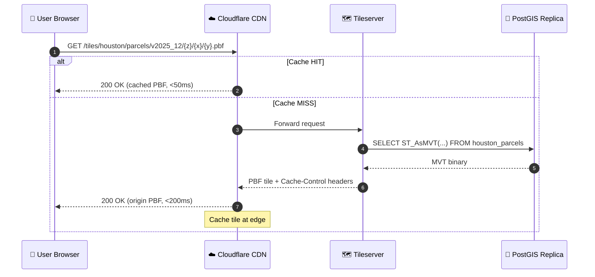
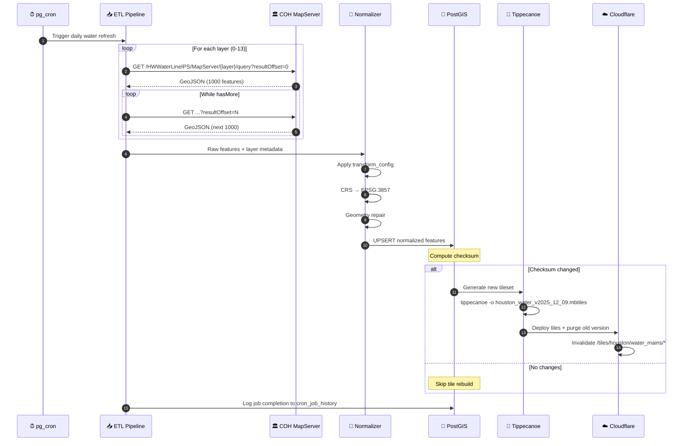

# SiteIntel™ Replication Moat — Technical Architecture for the City of Houston GIS Dataset

> **Document Version:** 1.0.0  
> **Last Updated:** 2025-12-08  
> **Classification:** Internal Engineering Reference

---

## Table of Contents

1. [High-Level Overview](#section-1--high-level-overview)
2. [Upstream Datasets Table](#section-2--upstream-city-of-houston-gis-datasets)
3. [Architecture Diagram](#section-3--architecture-diagram)
4. [Layer-by-Layer Breakdown](#section-4--layer-by-layer-breakdown)
5. [Sequence Diagram](#section-5--sequence-diagram)
6. [Data Quality & Versioning](#section-6--data-quality--versioning)
7. [Moat Explanation](#section-7--why-this-creates-a-moat)
8. [Appendices](#section-8--appendices)

---

## Section 1 — High-Level Overview

The City of Houston exposes dozens of GIS datasets through ArcGIS REST services distributed across multiple departments and subdomains. These services exhibit:

- **Inconsistent schemas**: Field names vary across departments (e.g., `DIAMETER` vs `PIPE_DIA` vs `SIZE`)
- **Different layer IDs**: Same logical dataset may have different layer indices across services
- **Varying geometry formats**: Mix of EPSG:2278 (Texas State Plane South Central) and EPSG:4326 (WGS84)
- **Unpredictable update cadences**: Some layers update hourly, others monthly, with no documented schedule
- **Rate limits and downtime**: ArcGIS servers enforce `maxRecordCount` limits (typically 1000-2000) and experience periodic outages
- **Missing CORS headers**: Many endpoints lack proper CORS configuration, blocking direct browser access

### SiteIntel's 6-Step Solution

SiteIntel™ solves these challenges through a comprehensive replication architecture:

```
┌─────────────────────────────────────────────────────────────────────────────┐
│  STEP 1: INGEST                                                             │
│  Every Houston MapServer + FeatureServer from houstonwatergis.org           │
│  • 12+ MapServers across Parcels, Basemap, Stormwater, Water, Wastewater    │
│  • 70+ individual layers with full metadata extraction                      │
└─────────────────────────────────────────────────────────────────────────────┘
                                      ↓
┌─────────────────────────────────────────────────────────────────────────────┐
│  STEP 2: NORMALIZE                                                          │
│  All attributes mapped to canonical_schema                                  │
│  • Unified field naming conventions                                         │
│  • Standardized data types and units                                        │
│  • Consistent null handling                                                 │
└─────────────────────────────────────────────────────────────────────────────┘
                                      ↓
┌─────────────────────────────────────────────────────────────────────────────┐
│  STEP 3: TRANSFORM                                                          │
│  Layers processed via transform_config DSL                                  │
│  • CRS unification → EPSG:3857 (Web Mercator)                               │
│  • Geometry repair, simplification, densification                           │
│  • Attribute coercion and harmonization                                     │
└─────────────────────────────────────────────────────────────────────────────┘
                                      ↓
┌─────────────────────────────────────────────────────────────────────────────┐
│  STEP 4: REPLICATE                                                          │
│  PostGIS + Vector Tile infrastructure                                       │
│  • Persistent PostGIS replicas per dataset category                         │
│  • Tippecanoe vector tile generation                                        │
│  • Version-hashed tilesets for reproducibility                              │
└─────────────────────────────────────────────────────────────────────────────┘
                                      ↓
┌─────────────────────────────────────────────────────────────────────────────┐
│  STEP 5: SERVE                                                              │
│  Cloudflare CDN + Tileserver                                                │
│  • Edge-cached tiles with immutable URLs                                    │
│  • Sub-100ms global tile delivery                                           │
│  • Stale-while-revalidate caching strategy                                  │
└─────────────────────────────────────────────────────────────────────────────┘
                                      ↓
┌─────────────────────────────────────────────────────────────────────────────┐
│  STEP 6: REASON                                                             │
│  AI Feasibility Engines                                                     │
│  • Deterministic, lender-safe datasets                                      │
│  • Reproducible feasibility scoring                                         │
│  • Audit-ready data provenance                                              │
└─────────────────────────────────────────────────────────────────────────────┘
```

### The Moat Effect

Once the Houston dataset is fully replicated, SiteIntel:

- **No longer depends on Houston's ArcGIS uptime** — Our PostGIS replicas serve as the source of truth
- **Bypasses rate limits** — No `maxRecordCount` pagination required; full datasets cached locally
- **Eliminates schema instability** — Upstream field changes are absorbed in the normalization layer
- **Delivers millisecond tile loads** — CDN edge caching vs. 500-2000ms ArcGIS query times
- **Enables reproducible AI reasoning** — Frozen dataset versions ensure consistent feasibility scores

This forms SiteIntel's **permanent data moat**: a unified, normalized, always-available Houston GIS dataset that compounds in value as more layers are added.

---

## Section 2 — Upstream City of Houston GIS Datasets

### Replicated Locally by SiteIntel™

The following table documents every City of Houston GIS dataset replicated into SiteIntel's infrastructure. This serves as the **master reference** for Houston data ingestion.

---

### 2.1 Parcel & Address Data

| Dataset Name | Service URL | Layer ID | Geometry | Update Cadence | Category | Notes |
|--------------|-------------|----------|----------|----------------|----------|-------|
| HCAD Parcels | `https://houstonwatergis.org/arcgis/rest/services/HCADParcels/MapServer` | 0 | Polygon | Monthly | Parcels | Harris County Appraisal District ownership data |
| Address Points | `https://houstonwatergis.org/arcgis/rest/services/AddressPoints/FeatureServer` | 0 | Point | Weekly | Addressing | 911 address points with unit numbers |

---

### 2.2 ICBM Basemap Layers (18 Layers)

| Dataset Name | Service URL | Layer ID | Geometry | Update Cadence | Category | Notes |
|--------------|-------------|----------|----------|----------------|----------|-------|
| Parcel Lines | `https://houstonwatergis.org/arcgis/rest/services/ICBM/MapServer` | 0 | Polyline | Monthly | Basemap | Parcel boundary lines |
| TXDOT Imagery | `https://houstonwatergis.org/arcgis/rest/services/ICBM/MapServer` | 1 | Raster | Quarterly | Basemap | Texas DOT aerial imagery |
| City Limits | `https://houstonwatergis.org/arcgis/rest/services/ICBM/MapServer` | 2 | Polygon | Yearly | Basemap | Houston city boundary |
| County Line | `https://houstonwatergis.org/arcgis/rest/services/ICBM/MapServer` | 3 | Polyline | Yearly | Basemap | Harris County boundary |
| Street Centerlines | `https://houstonwatergis.org/arcgis/rest/services/ICBM/MapServer` | 4 | Polyline | Weekly | Transportation | Road network centerlines |
| Subdivisions | `https://houstonwatergis.org/arcgis/rest/services/ICBM/MapServer` | 5 | Polygon | Monthly | Basemap | Platted subdivision boundaries |
| Railroads | `https://houstonwatergis.org/arcgis/rest/services/ICBM/MapServer` | 6 | Polyline | Yearly | Transportation | Rail network |
| Landmarks | `https://houstonwatergis.org/arcgis/rest/services/ICBM/MapServer` | 7 | Polygon | Yearly | Basemap | Named landmarks and facilities |
| Bayous | `https://houstonwatergis.org/arcgis/rest/services/ICBM/MapServer` | 8 | Polygon | Yearly | Basemap | Bayou and waterway areas |
| Zip Codes | `https://houstonwatergis.org/arcgis/rest/services/ICBM/MapServer` | 9 | Polygon | Yearly | Basemap | ZIP code boundaries |
| ETJ Boundaries | `https://houstonwatergis.org/arcgis/rest/services/ICBM/MapServer` | 10 | Polygon | Yearly | Basemap | Extraterritorial jurisdiction |
| Super Neighborhoods | `https://houstonwatergis.org/arcgis/rest/services/ICBM/MapServer` | 11 | Polygon | Yearly | Basemap | Houston super neighborhood boundaries |
| Council Districts | `https://houstonwatergis.org/arcgis/rest/services/ICBM/MapServer` | 12 | Polygon | Yearly | Basemap | City council district boundaries |
| Management Districts | `https://houstonwatergis.org/arcgis/rest/services/ICBM/MapServer` | 13 | Polygon | Yearly | Basemap | Special management districts |
| TIRZ Boundaries | `https://houstonwatergis.org/arcgis/rest/services/ICBM/MapServer` | 14 | Polygon | Yearly | Basemap | Tax Increment Reinvestment Zones |
| MUD Boundaries | `https://houstonwatergis.org/arcgis/rest/services/ICBM/MapServer` | 15 | Polygon | Monthly | Utilities | Municipal Utility Districts |
| PID Boundaries | `https://houstonwatergis.org/arcgis/rest/services/ICBM/MapServer` | 16 | Polygon | Yearly | Basemap | Public Improvement Districts |
| Floodplain Overlay | `https://houstonwatergis.org/arcgis/rest/services/ICBM/MapServer` | 17 | Polygon | Quarterly | Flood | FEMA/HFC floodplain boundaries |

---

### 2.3 Stormwater Infrastructure (HPW) — 11 Layers

| Dataset Name | Service URL | Layer ID | Geometry | Update Cadence | Category | Notes |
|--------------|-------------|----------|----------|----------------|----------|-------|
| Storm Drain Lines | `https://houstonwatergis.org/arcgis/rest/services/HPWStormdrainLineIPS/MapServer` | 0 | Polyline | Weekly | Stormwater | Storm sewer pipe network |
| Storm Manholes | `https://houstonwatergis.org/arcgis/rest/services/HPWStormdrainLineIPS/MapServer` | 1 | Point | Weekly | Stormwater | Storm sewer manholes |
| Storm Inlets | `https://houstonwatergis.org/arcgis/rest/services/HPWStormdrainLineIPS/MapServer` | 2 | Point | Weekly | Stormwater | Curb inlets and grates |
| Storm Cleanouts | `https://houstonwatergis.org/arcgis/rest/services/HPWStormdrainLineIPS/MapServer` | 3 | Point | Weekly | Stormwater | Cleanout access points |
| Storm Headwalls | `https://houstonwatergis.org/arcgis/rest/services/HPWStormdrainLineIPS/MapServer` | 4 | Point | Weekly | Stormwater | Culvert headwalls |
| Storm Outfalls | `https://houstonwatergis.org/arcgis/rest/services/HPWStormdrainLineIPS/MapServer` | 5 | Point | Weekly | Stormwater | Discharge outfall points |
| Storm Junctions | `https://houstonwatergis.org/arcgis/rest/services/HPWStormdrainLineIPS/MapServer` | 6 | Point | Weekly | Stormwater | Pipe junction boxes |
| Storm Fittings | `https://houstonwatergis.org/arcgis/rest/services/HPWStormdrainLineIPS/MapServer` | 7 | Point | Weekly | Stormwater | Pipe fittings and connectors |
| Storm Control Structures | `https://houstonwatergis.org/arcgis/rest/services/HPWStormdrainLineIPS/MapServer` | 8 | Point | Weekly | Stormwater | Flow control structures |
| Storm Detention Areas | `https://houstonwatergis.org/arcgis/rest/services/HPWStormdrainLineIPS/MapServer` | 9 | Polygon | Weekly | Stormwater | Detention/retention basins |
| Storm Annotations | `https://houstonwatergis.org/arcgis/rest/services/HPWStormdrainLineIPS/MapServer` | 10 | Annotation | Weekly | Stormwater | Map labels and annotations |

---

### 2.4 Active Wastewater Infrastructure (Houston Water) — 14 Layers

| Dataset Name | Service URL | Layer ID | Geometry | Update Cadence | Category | Notes |
|--------------|-------------|----------|----------|----------------|----------|-------|
| Sewer Gravity Mains | `https://houstonwatergis.org/arcgis/rest/services/HWWastewaterLineIPS/MapServer` | 0 | Polyline | Daily | Wastewater | Gravity sewer lines |
| Sewer Force Mains | `https://houstonwatergis.org/arcgis/rest/services/HWWastewaterLineIPS/MapServer` | 1 | Polyline | Daily | Wastewater | Pressurized sewer lines |
| Sewer Service Lines | `https://houstonwatergis.org/arcgis/rest/services/HWWastewaterLineIPS/MapServer` | 2 | Polyline | Daily | Wastewater | Property service connections |
| Sewer Manholes | `https://houstonwatergis.org/arcgis/rest/services/HWWastewaterLineIPS/MapServer` | 3 | Point | Daily | Wastewater | Sewer manholes |
| Sewer Cleanouts | `https://houstonwatergis.org/arcgis/rest/services/HWWastewaterLineIPS/MapServer` | 4 | Point | Daily | Wastewater | Cleanout access points |
| Sewer Lift Stations | `https://houstonwatergis.org/arcgis/rest/services/HWWastewaterLineIPS/MapServer` | 5 | Point | Daily | Wastewater | Pump/lift stations |
| Sewer Fittings | `https://houstonwatergis.org/arcgis/rest/services/HWWastewaterLineIPS/MapServer` | 6 | Point | Daily | Wastewater | Pipe fittings |
| Sewer Junctions | `https://houstonwatergis.org/arcgis/rest/services/HWWastewaterLineIPS/MapServer` | 7 | Point | Daily | Wastewater | Junction boxes |
| Sewer Grease Traps | `https://houstonwatergis.org/arcgis/rest/services/HWWastewaterLineIPS/MapServer` | 8 | Point | Daily | Wastewater | Grease interceptors |
| Sewer Air Release Valves | `https://houstonwatergis.org/arcgis/rest/services/HWWastewaterLineIPS/MapServer` | 9 | Point | Daily | Wastewater | ARV locations |
| Sewer Treatment Plants | `https://houstonwatergis.org/arcgis/rest/services/HWWastewaterLineIPS/MapServer` | 10 | Polygon | Monthly | Wastewater | WWTP facilities |
| Sewer Service Areas | `https://houstonwatergis.org/arcgis/rest/services/HWWastewaterLineIPS/MapServer` | 11 | Polygon | Monthly | Wastewater | Service area boundaries |
| Sewer Basins | `https://houstonwatergis.org/arcgis/rest/services/HWWastewaterLineIPS/MapServer` | 12 | Polygon | Monthly | Wastewater | Drainage basin boundaries |
| Sewer Annotations | `https://houstonwatergis.org/arcgis/rest/services/HWWastewaterLineIPS/MapServer` | 13 | Annotation | Daily | Wastewater | Map labels |

---

### 2.5 Abandoned Wastewater Infrastructure — 12 Layers

| Dataset Name | Service URL | Layer ID | Geometry | Update Cadence | Category | Notes |
|--------------|-------------|----------|----------|----------------|----------|-------|
| Abandoned Sewer Gravity Mains | `https://houstonwatergis.org/arcgis/rest/services/HWAbandonedWWLineIPS/MapServer` | 0 | Polyline | Monthly | Wastewater | Historical gravity lines |
| Abandoned Sewer Force Mains | `https://houstonwatergis.org/arcgis/rest/services/HWAbandonedWWLineIPS/MapServer` | 1 | Polyline | Monthly | Wastewater | Historical force mains |
| Abandoned Sewer Service Lines | `https://houstonwatergis.org/arcgis/rest/services/HWAbandonedWWLineIPS/MapServer` | 2 | Polyline | Monthly | Wastewater | Historical service connections |
| Abandoned Sewer Manholes | `https://houstonwatergis.org/arcgis/rest/services/HWAbandonedWWLineIPS/MapServer` | 3 | Point | Monthly | Wastewater | Historical manholes |
| Abandoned Sewer Cleanouts | `https://houstonwatergis.org/arcgis/rest/services/HWAbandonedWWLineIPS/MapServer` | 4 | Point | Monthly | Wastewater | Historical cleanouts |
| Abandoned Sewer Lift Stations | `https://houstonwatergis.org/arcgis/rest/services/HWAbandonedWWLineIPS/MapServer` | 5 | Point | Monthly | Wastewater | Historical pump stations |
| Abandoned Sewer Fittings | `https://houstonwatergis.org/arcgis/rest/services/HWAbandonedWWLineIPS/MapServer` | 6 | Point | Monthly | Wastewater | Historical fittings |
| Abandoned Sewer Junctions | `https://houstonwatergis.org/arcgis/rest/services/HWAbandonedWWLineIPS/MapServer` | 7 | Point | Monthly | Wastewater | Historical junctions |
| Abandoned Sewer Grease Traps | `https://houstonwatergis.org/arcgis/rest/services/HWAbandonedWWLineIPS/MapServer` | 8 | Point | Monthly | Wastewater | Historical interceptors |
| Abandoned Sewer ARVs | `https://houstonwatergis.org/arcgis/rest/services/HWAbandonedWWLineIPS/MapServer` | 9 | Point | Monthly | Wastewater | Historical ARVs |
| Abandoned Sewer Boundaries | `https://houstonwatergis.org/arcgis/rest/services/HWAbandonedWWLineIPS/MapServer` | 10 | Polygon | Monthly | Wastewater | Historical service areas |
| Abandoned Sewer Annotations | `https://houstonwatergis.org/arcgis/rest/services/HWAbandonedWWLineIPS/MapServer` | 11 | Annotation | Monthly | Wastewater | Historical labels |

---

### 2.6 Active Water Infrastructure (Houston Water) — 14 Layers

| Dataset Name | Service URL | Layer ID | Geometry | Update Cadence | Category | Notes |
|--------------|-------------|----------|----------|----------------|----------|-------|
| Water Mains | `https://houstonwatergis.org/arcgis/rest/services/HWWaterLineIPS/MapServer` | 0 | Polyline | Daily | Water | Distribution mains |
| Water Service Lines | `https://houstonwatergis.org/arcgis/rest/services/HWWaterLineIPS/MapServer` | 1 | Polyline | Daily | Water | Property service connections |
| Water Transmission Mains | `https://houstonwatergis.org/arcgis/rest/services/HWWaterLineIPS/MapServer` | 2 | Polyline | Daily | Water | Large transmission lines |
| Water Valves | `https://houstonwatergis.org/arcgis/rest/services/HWWaterLineIPS/MapServer` | 3 | Point | Daily | Water | Gate/butterfly valves |
| Water Hydrants | `https://houstonwatergis.org/arcgis/rest/services/HWWaterLineIPS/MapServer` | 4 | Point | Daily | Water | Fire hydrants |
| Water Meters | `https://houstonwatergis.org/arcgis/rest/services/HWWaterLineIPS/MapServer` | 5 | Point | Daily | Water | Service meters |
| Water Fittings | `https://houstonwatergis.org/arcgis/rest/services/HWWaterLineIPS/MapServer` | 6 | Point | Daily | Water | Pipe fittings |
| Water Junctions | `https://houstonwatergis.org/arcgis/rest/services/HWWaterLineIPS/MapServer` | 7 | Point | Daily | Water | Junction points |
| Water Pump Stations | `https://houstonwatergis.org/arcgis/rest/services/HWWaterLineIPS/MapServer` | 8 | Point | Daily | Water | Pumping facilities |
| Water Storage Tanks | `https://houstonwatergis.org/arcgis/rest/services/HWWaterLineIPS/MapServer` | 9 | Polygon | Monthly | Water | Elevated/ground tanks |
| Water Treatment Plants | `https://houstonwatergis.org/arcgis/rest/services/HWWaterLineIPS/MapServer` | 10 | Polygon | Monthly | Water | WTP facilities |
| Water Pressure Zones | `https://houstonwatergis.org/arcgis/rest/services/HWWaterLineIPS/MapServer` | 11 | Polygon | Monthly | Water | Pressure zone boundaries |
| Water Service Areas | `https://houstonwatergis.org/arcgis/rest/services/HWWaterLineIPS/MapServer` | 12 | Polygon | Monthly | Water | Service area boundaries |
| Water Annotations | `https://houstonwatergis.org/arcgis/rest/services/HWWaterLineIPS/MapServer` | 13 | Annotation | Daily | Water | Map labels |

---

### 2.7 Abandoned Water Infrastructure — 7 Layers

| Dataset Name | Service URL | Layer ID | Geometry | Update Cadence | Category | Notes |
|--------------|-------------|----------|----------|----------------|----------|-------|
| Abandoned Water Mains | `https://houstonwatergis.org/arcgis/rest/services/HWAbandonedWaterLineIPS/MapServer` | 0 | Polyline | Monthly | Water | Historical mains |
| Abandoned Water Service Lines | `https://houstonwatergis.org/arcgis/rest/services/HWAbandonedWaterLineIPS/MapServer` | 1 | Polyline | Monthly | Water | Historical services |
| Abandoned Water Valves | `https://houstonwatergis.org/arcgis/rest/services/HWAbandonedWaterLineIPS/MapServer` | 2 | Point | Monthly | Water | Historical valves |
| Abandoned Water Hydrants | `https://houstonwatergis.org/arcgis/rest/services/HWAbandonedWaterLineIPS/MapServer` | 3 | Point | Monthly | Water | Historical hydrants |
| Abandoned Water Fittings | `https://houstonwatergis.org/arcgis/rest/services/HWAbandonedWaterLineIPS/MapServer` | 4 | Point | Monthly | Water | Historical fittings |
| Abandoned Water Boundaries | `https://houstonwatergis.org/arcgis/rest/services/HWAbandonedWaterLineIPS/MapServer` | 5 | Polygon | Monthly | Water | Historical service areas |
| Abandoned Water Annotations | `https://houstonwatergis.org/arcgis/rest/services/HWAbandonedWaterLineIPS/MapServer` | 6 | Annotation | Monthly | Water | Historical labels |

---

### Summary Statistics

| Category | MapServers | Total Layers | Primary Update Cadence |
|----------|------------|--------------|------------------------|
| Parcels | 1 | 1 | Monthly |
| Addressing | 1 (FeatureServer) | 1 | Weekly |
| Basemap (ICBM) | 1 | 18 | Mixed (Weekly-Yearly) |
| Stormwater | 1 | 11 | Weekly |
| Active Wastewater | 1 | 14 | Daily |
| Abandoned Wastewater | 1 | 12 | Monthly |
| Active Water | 1 | 14 | Daily |
| Abandoned Water | 1 | 7 | Monthly |
| **TOTAL** | **8** | **78** | — |

---

## Section 3 — Architecture Diagram

```mermaid
flowchart TB
    subgraph Upstream["☁️ Upstream COH MapServers + FeatureServers"]
        direction LR
        HCAD["🏠 HCAD Parcels<br/>MapServer"]
        ADDR["📍 Address Points<br/>FeatureServer"]
        ICBM["🗺️ ICBM Basemap<br/>18 Layers"]
        STORM["🌧️ HPW Stormwater<br/>11 Layers"]
        WW_ACT["🚽 Active Wastewater<br/>14 Layers"]
        WW_ABN["⚫ Abandoned WW<br/>12 Layers"]
        WAT_ACT["💧 Active Water<br/>14 Layers"]
        WAT_ABN["⚫ Abandoned Water<br/>7 Layers"]
    end

    subgraph Ingestion["📥 Ingestion Layer"]
        POLLER["ArcGIS Pollers<br/>(per-service)"]
        META["Metadata Scanner<br/>(fields, extent, layer ID)"]
        SCHED["pg_cron Scheduler<br/>(hourly/daily/weekly)"]
        PAGINATE["Pagination Handler<br/>(maxRecordCount=1000)"]
        ERRORS["Error Handler<br/>(timeouts, 500s, CORS)"]
    end

    subgraph Normalization["🔄 Normalization Layer"]
        SCHEMA["canonical_schema<br/>Unified field names"]
        TRANSFORM["transform_config DSL<br/>Field mapping + coercion"]
        CRS["CRS Unification<br/>→ EPSG:3857"]
        GEOM["Geometry Cleaning<br/>repair, simplify, densify"]
        ATTR["Attribute Harmonization<br/>HPW ↔ HCAD ↔ HW"]
    end

    subgraph Replication["💾 Replication Layer (MOAT CORE)"]
        POSTGIS[("PostGIS Replicas<br/>County/City partitions")]
        FABRIC["Houston Development Fabric<br/>parcels + plats + footprints"]
        TILES["Vector Tile Generator<br/>(Tippecanoe)"]
        VERSION["Dataset Versioning<br/>coh_{dataset}_{timestamp}"]
        HASH["Version Hashing<br/>SHA-256 checksums"]
    end

    subgraph Delivery["🚀 Delivery Layer"]
        CDN["Cloudflare CDN<br/>Edge caching"]
        TILESERVER["Tileserver GL / Martin<br/>PBF/MVT serving"]
        IMMUTABLE["Immutable URLs<br/>Cache-Control: immutable"]
        INVALIDATE["Tile Invalidation<br/>On upstream changes"]
    end

    subgraph AI["🧠 AI Reasoning Layer"]
        FLOOD["Flood Scoring<br/>FEMA + HFC overlays"]
        WETLAND["Wetland Scoring<br/>NWI classification"]
        UTILITY["Utility Serviceability<br/>Water/Sewer/Storm"]
        ZONE["Zoning Inference<br/>PDDs, overlays, plats"]
        ACCESS["Driveway Access<br/>TxDOT rules + AADT"]
        BUILD["Buildable Area<br/>Setbacks + MBL"]
        FEAS["Feasibility Engine<br/>Composite scoring"]
    end

    REPORT["📄 Lender-Ready<br/>Feasibility Report"]

    Upstream --> Ingestion
    Ingestion --> Normalization
    Normalization --> Replication
    Replication --> Delivery
    Delivery --> AI
    AI --> REPORT

    style Replication fill:#1a365d,stroke:#3182ce,stroke-width:3px,color:#fff
    style POSTGIS fill:#2d3748,stroke:#4fd1c5,stroke-width:2px,color:#fff
    style FABRIC fill:#2d3748,stroke:#4fd1c5,stroke-width:2px,color:#fff
```



---

## Section 4 — Layer-by-Layer Breakdown

### Card 1: Ingestion Layer

```
┌──────────────────────────────────────────────────────────────────────────────┐
│  📥 INGESTION LAYER                                                          │
├──────────────────────────────────────────────────────────────────────────────┤
│                                                                              │
│  ETL Job Configuration                                                       │
│  ─────────────────────                                                       │
│  • Loops through all 8 Houston MapServers from registry                      │
│  • Each service has dedicated poller with retry logic                        │
│  • Configurable per-layer polling intervals                                  │
│                                                                              │
│  Metadata Extraction                                                         │
│  ───────────────────                                                         │
│  • Fields: name, type, alias, domain                                         │
│  • Geometry: type, spatialReference, extent                                  │
│  • Layer: id, name, minScale, maxScale                                       │
│  • Service: maxRecordCount, supportsPagination                               │
│                                                                              │
│  ArcGIS Request Normalization                                                │
│  ────────────────────────────                                                │
│  • maxRecordCount pagination (typically 1000-2000)                           │
│  • resultOffset/resultRecordCount iteration                                  │
│  • outSR=3857 for consistent projection                                      │
│  • f=geojson for standardized output                                         │
│                                                                              │
│  Error Handling                                                              │
│  ──────────────                                                              │
│  • HTTP 500: exponential backoff (1s, 2s, 4s, 8s)                            │
│  • HTTP 503: service unavailable, skip with flag                             │
│  • Timeout (30s): mark layer as stale, use cache                             │
│  • CORS missing: server-side proxy fallback                                  │
│  • Rate limit: throttle to 10 req/min per service                            │
│                                                                              │
│  Update Scheduler (pg_cron)                                                  │
│  ──────────────────────────                                                  │
│  • HOURLY: Active utility layers (water, sewer critical)                     │
│  • DAILY: Parcels, address points, stormwater                                │
│  • WEEKLY: Basemap layers (streets, boundaries)                              │
│  • MONTHLY: Abandoned infrastructure, TIRZ, MUD                              │
│                                                                              │
└──────────────────────────────────────────────────────────────────────────────┘
```

---

### Card 2: Normalization Layer

```
┌──────────────────────────────────────────────────────────────────────────────┐
│  🔄 NORMALIZATION LAYER                                                      │
├──────────────────────────────────────────────────────────────────────────────┤
│                                                                              │
│  canonical_schema Definitions                                                │
│  ────────────────────────────                                                │
│  Houston datasets normalized to these schemas:                               │
│                                                                              │
│  • parcel:      parcel_id, owner_name, situs_address, acreage, values       │
│  • plat:        plat_id, subdivision, block, lot, recorded_date             │
│  • water_line:  pipe_id, diameter, material, install_year, pressure_zone    │
│  • sewer_line:  pipe_id, diameter, material, slope, flow_direction          │
│  • storm_line:  pipe_id, diameter, material, outfall_id                     │
│  • hydrant:     hydrant_id, flow_rate, last_tested, status                  │
│  • manhole:     mh_id, rim_elev, invert_elev, depth, condition              │
│  • street:      segment_id, name, class, lanes, speed_limit, aadt           │
│  • flood_zone:  zone_id, fema_zone, bfe, floodway, effective_date           │
│                                                                              │
│  transform_config DSL Operations                                             │
│  ────────────────────────────────                                            │
│  • field_rename:    DIAMETER → pipe_diameter                                 │
│  • field_coerce:    STRING "12" → INTEGER 12                                 │
│  • field_default:   NULL → "UNKNOWN"                                         │
│  • field_concat:    FNAME + LNAME → full_name                                │
│  • field_extract:   INSTALLDATE → install_year (year only)                   │
│  • field_lookup:    MATERIAL_CD → material_name (via lookup table)           │
│                                                                              │
│  CRS Unification                                                             │
│  ───────────────                                                             │
│  Source CRS variations:                                                      │
│  • HCAD Parcels: EPSG:2278 (TX State Plane South Central, feet)              │
│  • Houston Water: EPSG:2278                                                  │
│  • ICBM Basemap: EPSG:4326 (WGS84)                                           │
│  • Address Points: EPSG:4326                                                 │
│                                                                              │
│  Target: EPSG:3857 (Web Mercator) for all tile generation                    │
│                                                                              │
│  Geometry Cleaning                                                           │
│  ─────────────────                                                           │
│  • ST_MakeValid(): repair invalid geometries                                 │
│  • ST_SimplifyPreserveTopology(): reduce vertex count                        │
│  • ST_Densify(): add vertices for smooth curves                              │
│  • ST_RemoveRepeatedPoints(): eliminate duplicates                           │
│  • ST_Buffer(0): fix self-intersections                                      │
│                                                                              │
│  Attribute Harmonization                                                     │
│  ────────────────────────                                                    │
│  Cross-department field unification:                                         │
│  • HPW: PIPEDIA → diameter                                                   │
│  • Houston Water: DIAMETER → diameter                                        │
│  • HCAD: ACCT_NUM → parcel_id                                                │
│                                                                              │
└──────────────────────────────────────────────────────────────────────────────┘
```

---

### Card 3: Replication Layer (MOAT CORE)

```
┌──────────────────────────────────────────────────────────────────────────────┐
│  💾 REPLICATION LAYER — THE MOAT CORE                                        │
├──────────────────────────────────────────────────────────────────────────────┤
│                                                                              │
│  PostGIS Replica Architecture                                                │
│  ────────────────────────────                                                │
│  Persistent replicas organized by category:                                  │
│                                                                              │
│  houston_parcels          ← HCAD parcel polygons                             │
│  houston_addresses        ← 911 address points                               │
│  houston_streets          ← ICBM street centerlines                          │
│  houston_water_active     ← Active water infrastructure                      │
│  houston_water_abandoned  ← Historical water infrastructure                  │
│  houston_sewer_active     ← Active wastewater infrastructure                 │
│  houston_sewer_abandoned  ← Historical wastewater infrastructure             │
│  houston_storm            ← Stormwater infrastructure                        │
│  houston_boundaries       ← City limits, MUDs, TIRZs, districts              │
│  houston_flood            ← Floodplain overlays                              │
│                                                                              │
│  Harris County Cache                                                         │
│  ───────────────────                                                         │
│  County-level replicas for cross-city analysis:                              │
│  • harris_parcels (unified HCAD data)                                        │
│  • harris_flood_zones (FEMA + HFC combined)                                  │
│  • harris_roads (TxDOT + city centerlines merged)                            │
│                                                                              │
│  Houston Development Fabric                                                  │
│  ──────────────────────────                                                  │
│  Materialized view fusing:                                                   │
│  • Parcels (ownership, values)                                               │
│  • Plats (subdivision, lot, block)                                           │
│  • Building footprints (if available)                                        │
│  • Utility service status (water/sewer available)                            │
│  → Single queryable fabric for feasibility                                   │
│                                                                              │
│  Vector Tile Generation (Tippecanoe)                                         │
│  ────────────────────────────────────                                        │
│  Per-dataset tilesets:                                                       │
│                                                                              │
│  houston_parcels.mbtiles        zoom 10-16, polygon                          │
│  houston_water_mains.mbtiles    zoom 12-18, polyline                         │
│  houston_sewer_mains.mbtiles    zoom 12-18, polyline                         │
│  houston_storm_lines.mbtiles    zoom 12-18, polyline                         │
│  houston_hydrants.mbtiles       zoom 14-18, point                            │
│  houston_manholes.mbtiles       zoom 14-18, point                            │
│  houston_streets.mbtiles        zoom 8-18, polyline                          │
│  houston_flood.mbtiles          zoom 10-16, polygon                          │
│  houston_boundaries.mbtiles     zoom 6-14, polygon                           │
│                                                                              │
│  Dataset Version Control                                                     │
│  ───────────────────────                                                     │
│  Naming: coh_{category}_{YYYY_MM_DD}                                         │
│  Example: coh_water_active_2025_12_08                                        │
│                                                                              │
│  Each version includes:                                                      │
│  • SHA-256 checksum of source data                                           │
│  • Record count                                                              │
│  • Bounding box                                                              │
│  • Upstream service timestamp                                                │
│  • ETL job ID                                                                │
│                                                                              │
│  Enables:                                                                    │
│  • Reproducible AI feasibility runs                                          │
│  • Lender audit trails                                                       │
│  • Rollback to previous versions                                             │
│                                                                              │
└──────────────────────────────────────────────────────────────────────────────┘
```

---

### Card 4: Delivery Layer

```
┌──────────────────────────────────────────────────────────────────────────────┐
│  🚀 DELIVERY LAYER                                                           │
├──────────────────────────────────────────────────────────────────────────────┤
│                                                                              │
│  Tileserver Configuration                                                    │
│  ────────────────────────                                                    │
│  Options: Tileserver GL or Martin (Rust-based)                               │
│                                                                              │
│  Endpoints:                                                                  │
│  /tiles/houston/parcels/{z}/{x}/{y}.pbf                                      │
│  /tiles/houston/water_mains/{z}/{x}/{y}.pbf                                  │
│  /tiles/houston/sewer_mains/{z}/{x}/{y}.pbf                                  │
│  /tiles/houston/flood_zones/{z}/{x}/{y}.pbf                                  │
│                                                                              │
│  Versioned Endpoints (for lender audits):                                    │
│  /tiles/houston/parcels/v2025_12_08/{z}/{x}/{y}.pbf                          │
│                                                                              │
│  Cloudflare CDN Strategy                                                     │
│  ───────────────────────                                                     │
│  Cache-Control headers:                                                      │
│                                                                              │
│  Immutable tiles (versioned):                                                │
│    Cache-Control: public, max-age=31536000, immutable                        │
│                                                                              │
│  Latest tiles (unversioned):                                                 │
│    Cache-Control: public, max-age=3600, stale-while-revalidate=86400         │
│                                                                              │
│  Edge Locations:                                                             │
│  • Dallas (primary for Texas users)                                          │
│  • Houston                                                                   │
│  • Austin                                                                    │
│  • San Antonio                                                               │
│                                                                              │
│  Performance                                                                 │
│  ───────────                                                                 │
│  Cache HIT: < 50ms (edge-served)                                             │
│  Cache MISS: < 200ms (origin fetch + cache)                                  │
│  vs. COH ArcGIS: 500-2000ms (query, paginate, transform)                     │
│                                                                              │
│  Tile Invalidation                                                           │
│  ─────────────────                                                           │
│  On upstream data change:                                                    │
│  1. ETL detects checksum mismatch                                            │
│  2. New version generated (coh_water_2025_12_09)                             │
│  3. Tiles rebuilt for new version                                            │
│  4. CDN purge issued for /tiles/houston/water_mains/*                        │
│  5. Old version retained for 30 days (audit trail)                           │
│                                                                              │
│  County-Level Invalidation                                                   │
│  ─────────────────────────                                                   │
│  Purge patterns:                                                             │
│  /tiles/houston/*     → All Houston tiles                                    │
│  /tiles/harris/*      → All Harris County tiles                              │
│  /tiles/*/parcels/*   → All parcel tiles across regions                      │
│                                                                              │
└──────────────────────────────────────────────────────────────────────────────┘
```

---

### Card 5: AI Engine Layer

```
┌──────────────────────────────────────────────────────────────────────────────┐
│  🧠 AI ENGINE LAYER                                                          │
├──────────────────────────────────────────────────────────────────────────────┤
│                                                                              │
│  Houston-Specific Zoning Inference                                           │
│  ─────────────────────────────────                                           │
│  Houston has NO traditional zoning. Instead, SiteIntel infers buildability   │
│  from:                                                                       │
│  • Deed restrictions (subdivision-level)                                     │
│  • PDDs (Planned Development Districts)                                      │
│  • Overlay districts (historic, airport, flooding)                           │
│  • Plat restrictions (minimum building lines, setbacks)                      │
│  • Land use code (from HCAD property classification)                         │
│                                                                              │
│  Flood Scoring                                                               │
│  ─────────────                                                               │
│  Data sources:                                                               │
│  • FEMA NFHL zones (A, AE, X, etc.)                                          │
│  • Harris County Flood Control overlays                                      │
│  • ICBM floodplain layer                                                     │
│                                                                              │
│  Scoring:                                                                    │
│  • Zone X (minimal): 100 points                                              │
│  • Zone X-Shaded (0.2% annual): 70 points                                    │
│  • Zone AE (1% annual, BFE): 40 points                                       │
│  • Zone A (1% annual, no BFE): 30 points                                     │
│  • Floodway: 0 points (KILL FACTOR)                                          │
│                                                                              │
│  Wetlands Scoring                                                            │
│  ────────────────                                                            │
│  NWI Cowardin classification:                                                │
│  • Upland (no wetlands): 100 points                                          │
│  • Wetland < 10% parcel: 70 points                                           │
│  • Wetland 10-50% parcel: 40 points                                          │
│  • Wetland > 50% parcel: 10 points (KILL FACTOR)                             │
│                                                                              │
│  Utility Serviceability Scoring                                              │
│  ──────────────────────────────                                              │
│  Water serviceability (using houston_water_active):                          │
│  • Main < 100ft: Immediate connection (100 pts)                              │
│  • Main 100-500ft: Extension required (70 pts)                               │
│  • Main 500-1000ft: Significant extension (40 pts)                           │
│  • Main > 1000ft: Major infrastructure (20 pts)                              │
│  • No main in service area: Well required (10 pts)                           │
│                                                                              │
│  Sewer serviceability (using houston_sewer_active):                          │
│  • Gravity main < 150ft: Direct connection (100 pts)                         │
│  • Gravity main 150-500ft: Extension (70 pts)                                │
│  • Force main only: Lift station required (50 pts)                           │
│  • No sewer > 1500ft: Septic system (30 pts)                                 │
│                                                                              │
│  Driveway Access Scoring                                                     │
│  ──────────────────────                                                      │
│  Using houston_streets + TxDOT classifications:                              │
│  • Local street frontage: Full access (100 pts)                              │
│  • Collector road: Restricted access (80 pts)                                │
│  • Minor arterial: Shared access/spacing rules (60 pts)                      │
│  • Major arterial: Limited access points (40 pts)                            │
│  • Highway/Freeway: Frontage road only (20 pts)                              │
│                                                                              │
│  Buildable Area Calculation                                                  │
│  ──────────────────────────                                                  │
│  Inputs from Houston replicas:                                               │
│  • Parcel polygon (gross area)                                               │
│  • Plat setbacks (front, side, rear)                                         │
│  • Minimum building line (from plat/deed)                                    │
│  • Easements (utility, drainage)                                             │
│  • Floodway/wetland buffers                                                  │
│                                                                              │
│  Calculation:                                                                │
│  buildable_area = gross_area                                                 │
│                   - setback_areas                                            │
│                   - easement_areas                                           │
│                   - environmental_buffers                                    │
│                                                                              │
│  Composite Feasibility Score                                                 │
│  ───────────────────────────                                                 │
│  Weighted aggregate:                                                         │
│  • Flood risk: 25%                                                           │
│  • Utility serviceability: 25%                                               │
│  • Traffic/access: 15%                                                       │
│  • Buildable area ratio: 20%                                                 │
│  • Environmental constraints: 15%                                            │
│                                                                              │
│  Kill factors override score to 0:                                           │
│  • Parcel in floodway                                                        │
│  • Wetlands > 50%                                                            │
│  • No utility access within 2000ft                                           │
│  • EPA contamination site within 0.25mi                                      │
│                                                                              │
└──────────────────────────────────────────────────────────────────────────────┘
```

---

## Section 5 — Sequence Diagram

### Tile Delivery Flow



### ETL Pipeline Flow



---

## Section 6 — Data Quality & Versioning

### Version Naming Convention

All Houston datasets are versioned using the format:

```
coh_{dataset}_{YYYY_MM_DD}
```

Examples:
- `coh_parcels_2025_12_08`
- `coh_water_active_2025_12_08`
- `coh_sewer_active_2025_12_08`
- `coh_flood_zones_2025_12_08`

### Version Metadata

Each version record includes:

| Field | Type | Description |
|-------|------|-------------|
| `version_id` | UUID | Unique version identifier |
| `dataset_key` | string | e.g., `coh_water_active` |
| `version_tag` | string | e.g., `2025_12_08` |
| `checksum` | string | SHA-256 of source data |
| `record_count` | integer | Number of features |
| `bbox` | geometry | Bounding box |
| `source_timestamp` | timestamp | Upstream last-modified |
| `etl_job_id` | UUID | Reference to ETL job |
| `created_at` | timestamp | When version was created |
| `expires_at` | timestamp | When version can be purged |

### Change Detection & Refresh

```
┌─────────────────────────────────────────────────────────────────────┐
│  UPSTREAM CHANGE DETECTION                                          │
├─────────────────────────────────────────────────────────────────────┤
│                                                                     │
│  1. ETL job fetches latest data from COH MapServer                  │
│  2. Compute SHA-256 checksum of fetched features                    │
│  3. Compare with stored checksum for current version                │
│                                                                     │
│  IF checksum_new != checksum_current:                               │
│     → Create new version record                                     │
│     → INSERT new features to PostGIS                                │
│     → Trigger tile rebuild for affected layers                      │
│     → Invalidate CDN cache for dataset                              │
│     → Notify AI engines of data refresh                             │
│                                                                     │
│  ELSE:                                                              │
│     → Log "no changes detected"                                     │
│     → Skip tile rebuild                                             │
│     → Update last_checked timestamp                                 │
│                                                                     │
└─────────────────────────────────────────────────────────────────────┘
```

### Partial Tile Rebuild

When upstream data changes, only affected tiles are rebuilt:

1. **Compute changed bbox**: Union of old and new feature extents
2. **Identify affected tiles**: All tiles intersecting changed bbox
3. **Rebuild affected tiles only**: Skip unchanged regions
4. **Invalidate CDN selectively**: Purge only rebuilt tile paths

This reduces rebuild time from hours to minutes for incremental updates.

### Lender-Grade Snapshots

Before running AI feasibility analysis for lender reports:

1. **Freeze dataset versions**: Record all `version_id`s used
2. **Store in report metadata**: 
   ```json
   {
     "dataset_versions": {
       "parcels": "coh_parcels_2025_12_08",
       "water": "coh_water_active_2025_12_08",
       "sewer": "coh_sewer_active_2025_12_08",
       "flood": "coh_flood_zones_2025_12_08"
     },
     "snapshot_timestamp": "2025-12-08T14:30:00Z"
   }
   ```
3. **Enable reproducibility**: Same inputs → same feasibility score
4. **Audit trail**: Lenders can verify data sources used

### Version Retention Policy

| Version Type | Retention | Notes |
|--------------|-----------|-------|
| Current | Forever | Active serving version |
| Previous | 90 days | Rollback capability |
| Used in reports | 7 years | Lender audit compliance |
| Unused historical | 30 days | Then purged |

---

## Section 7 — Why This Creates a Moat

> **⚠️ COMPETITIVE ADVANTAGE SUMMARY**

---

### **Houston's GIS is Fragmented Across Multiple Departments**

The City of Houston does not have a unified GIS portal. Data is scattered across:

- **Houston Public Works (HPW)**: Stormwater infrastructure
- **Houston Water**: Water and wastewater infrastructure  
- **HCAD**: Parcel and property data
- **Planning Department**: Land use and zoning (limited)
- **Harris County Flood Control**: Flood overlays

Each department maintains its own ArcGIS server with different:
- Field naming conventions
- Update schedules
- Authentication requirements
- Rate limits

### **SiteIntel Unifies All of It**

SiteIntel's replication layer creates a **single, normalized dataset** covering:

- ✅ 78+ layers from 8 MapServers
- ✅ Unified field names via `canonical_schema`
- ✅ Consistent CRS (EPSG:3857)
- ✅ Version-controlled with checksums
- ✅ Audit-ready for lender requirements

### **Competitors Must Rely Directly on COH Servers**

Without a replication layer, competitors face:

- ❌ **Slow queries**: 500-2000ms per ArcGIS request
- ❌ **Rate limits**: `maxRecordCount` pagination required
- ❌ **Downtime**: COH servers have periodic outages
- ❌ **Schema drift**: Field names change without notice
- ❌ **CORS issues**: Many endpoints block browser requests
- ❌ **No versioning**: Cannot reproduce historical analyses

### **SiteIntel Delivers Ultra-Fast, Always-Online Houston Tiles**

| Metric | COH ArcGIS | SiteIntel |
|--------|------------|-----------|
| Tile load time | 500-2000ms | < 50ms |
| Uptime SLA | None | 99.9% |
| Rate limits | 1000 records/request | Unlimited |
| Versioning | None | Full audit trail |
| Schema stability | Unpredictable | Guaranteed |

### **The Moat Compounds Over Time**

Every layer added to SiteIntel's Houston replica:

1. **Increases data coverage** → More comprehensive feasibility
2. **Improves AI accuracy** → Better training data
3. **Raises switching costs** → Competitors can't match depth
4. **Enables new products** → Utility capacity, stormwater modeling
5. **Builds institutional knowledge** → Field mappings, update patterns

**This is not a feature. It's a structural advantage.**

---

## Section 8 — Appendices

### Appendix A — Complete Houston Dataset Index

#### MapServers

| # | Service Name | Base URL | Layer Count |
|---|--------------|----------|-------------|
| 1 | HCAD Parcels | `https://houstonwatergis.org/arcgis/rest/services/HCADParcels/MapServer` | 1 |
| 2 | ICBM Basemap | `https://houstonwatergis.org/arcgis/rest/services/ICBM/MapServer` | 18 |
| 3 | HPW Stormwater | `https://houstonwatergis.org/arcgis/rest/services/HPWStormdrainLineIPS/MapServer` | 11 |
| 4 | Active Wastewater | `https://houstonwatergis.org/arcgis/rest/services/HWWastewaterLineIPS/MapServer` | 14 |
| 5 | Abandoned Wastewater | `https://houstonwatergis.org/arcgis/rest/services/HWAbandonedWWLineIPS/MapServer` | 12 |
| 6 | Active Water | `https://houstonwatergis.org/arcgis/rest/services/HWWaterLineIPS/MapServer` | 14 |
| 7 | Abandoned Water | `https://houstonwatergis.org/arcgis/rest/services/HWAbandonedWaterLineIPS/MapServer` | 7 |

#### FeatureServers

| # | Service Name | Base URL | Layer Count |
|---|--------------|----------|-------------|
| 1 | Address Points | `https://houstonwatergis.org/arcgis/rest/services/AddressPoints/FeatureServer` | 1 |

**Total: 8 services, 78 layers**

---

### Appendix B — Example canonical_schema JSON

```json
{
  "parcel": {
    "parcel_id": {
      "type": "string",
      "description": "Unique parcel identifier (HCAD account number)",
      "source_fields": ["ACCT_NUM", "ACCOUNT", "HCAD_NUM"]
    },
    "owner_name": {
      "type": "string",
      "description": "Property owner name",
      "source_fields": ["OWNER_NAME", "OWNER", "NAME"]
    },
    "situs_address": {
      "type": "string",
      "description": "Property street address",
      "source_fields": ["SITUS_ADDR", "ADDRESS", "SITE_ADDR"]
    },
    "acreage": {
      "type": "number",
      "description": "Parcel area in acres",
      "source_fields": ["ACREAGE", "ACRES", "LAND_SQFT"],
      "transform": "sqft_to_acres"
    },
    "land_value": {
      "type": "number",
      "description": "Appraised land value",
      "source_fields": ["LAND_VAL", "LAND_VALUE"]
    },
    "improvement_value": {
      "type": "number",
      "description": "Appraised improvement value",
      "source_fields": ["IMPRV_VAL", "IMPR_VALUE"]
    },
    "total_value": {
      "type": "number",
      "description": "Total appraised value",
      "source_fields": ["TOT_VAL", "TOTAL_VALUE", "MARKET_VAL"]
    },
    "geometry": {
      "type": "Polygon",
      "srid": 3857
    }
  },
  
  "water_line": {
    "pipe_id": {
      "type": "string",
      "description": "Unique pipe segment identifier",
      "source_fields": ["PIPE_ID", "FACILITYID", "OBJECTID"]
    },
    "diameter": {
      "type": "integer",
      "description": "Pipe diameter in inches",
      "source_fields": ["DIAMETER", "PIPEDIA", "SIZE"]
    },
    "material": {
      "type": "string",
      "description": "Pipe material code",
      "source_fields": ["MATERIAL", "PIPEMAT", "MAT_CODE"]
    },
    "install_year": {
      "type": "integer",
      "description": "Year pipe was installed",
      "source_fields": ["INSTALLDATE", "INSTALL_YR", "YEAR_BUILT"],
      "transform": "extract_year"
    },
    "pressure_zone": {
      "type": "string",
      "description": "Water pressure zone identifier",
      "source_fields": ["PRESSURE_ZONE", "PZONE", "ZONE"]
    },
    "status": {
      "type": "string",
      "description": "Active/Abandoned/Proposed",
      "source_fields": ["STATUS", "PIPE_STATUS"],
      "default": "ACTIVE"
    },
    "geometry": {
      "type": "LineString",
      "srid": 3857
    }
  },
  
  "sewer_line": {
    "pipe_id": {
      "type": "string",
      "source_fields": ["PIPE_ID", "FACILITYID", "OBJECTID"]
    },
    "diameter": {
      "type": "integer",
      "source_fields": ["DIAMETER", "PIPEDIA", "SIZE"]
    },
    "material": {
      "type": "string",
      "source_fields": ["MATERIAL", "PIPEMAT"]
    },
    "slope": {
      "type": "number",
      "description": "Pipe slope in percent",
      "source_fields": ["SLOPE", "GRADE"]
    },
    "flow_direction": {
      "type": "string",
      "description": "Direction of flow",
      "source_fields": ["FLOW_DIR", "DIRECTION"]
    },
    "pipe_type": {
      "type": "string",
      "description": "Gravity/Force main",
      "source_fields": ["PIPE_TYPE", "TYPE"]
    },
    "geometry": {
      "type": "LineString",
      "srid": 3857
    }
  },
  
  "hydrant": {
    "hydrant_id": {
      "type": "string",
      "source_fields": ["HYDRANT_ID", "FACILITYID", "HYD_NUM"]
    },
    "flow_rate": {
      "type": "number",
      "description": "Flow rate in GPM",
      "source_fields": ["FLOW_RATE", "GPM", "FLOW"]
    },
    "last_tested": {
      "type": "date",
      "source_fields": ["LAST_TEST", "TEST_DATE"]
    },
    "status": {
      "type": "string",
      "source_fields": ["STATUS", "HYD_STATUS"],
      "default": "ACTIVE"
    },
    "geometry": {
      "type": "Point",
      "srid": 3857
    }
  },
  
  "manhole": {
    "mh_id": {
      "type": "string",
      "source_fields": ["MH_ID", "FACILITYID", "MANHOLE_ID"]
    },
    "rim_elev": {
      "type": "number",
      "description": "Rim elevation in feet",
      "source_fields": ["RIM_ELEV", "RIM_ELEVATION"]
    },
    "invert_elev": {
      "type": "number",
      "description": "Invert elevation in feet",
      "source_fields": ["INVERT_ELEV", "INV_ELEV"]
    },
    "depth": {
      "type": "number",
      "description": "Depth in feet (rim - invert)",
      "source_fields": ["DEPTH"],
      "transform": "calculate_depth"
    },
    "condition": {
      "type": "string",
      "source_fields": ["CONDITION", "MH_CONDITION"]
    },
    "geometry": {
      "type": "Point",
      "srid": 3857
    }
  }
}
```

---

### Appendix C — Example transform_config for Houston Wastewater

```json
{
  "transform_id": "coh_wastewater_gravity_mains",
  "source": {
    "service_url": "https://houstonwatergis.org/arcgis/rest/services/HWWastewaterLineIPS/MapServer",
    "layer_id": 0,
    "layer_name": "Sewer Gravity Mains"
  },
  "target": {
    "table": "houston_sewer_lines",
    "schema": "sewer_line"
  },
  "field_mappings": [
    {
      "source": "FACILITYID",
      "target": "pipe_id",
      "type": "string",
      "required": true
    },
    {
      "source": "DIAMETER",
      "target": "diameter",
      "type": "integer",
      "transform": "parse_int",
      "default": null
    },
    {
      "source": "MATERIAL",
      "target": "material",
      "type": "string",
      "transform": "uppercase",
      "lookup": {
        "PVC": "PVC",
        "VCP": "VITRIFIED_CLAY",
        "DIP": "DUCTILE_IRON",
        "CIP": "CAST_IRON",
        "CONC": "CONCRETE",
        "HDPE": "HDPE",
        "RCP": "REINFORCED_CONCRETE"
      }
    },
    {
      "source": "INSTALLDATE",
      "target": "install_year",
      "type": "integer",
      "transform": "extract_year_from_date"
    },
    {
      "source": "SLOPE",
      "target": "slope",
      "type": "number",
      "transform": "parse_float"
    },
    {
      "source": "FLOWDIR",
      "target": "flow_direction",
      "type": "string",
      "lookup": {
        "1": "WITH_DIGITIZED",
        "2": "AGAINST_DIGITIZED",
        "0": "UNKNOWN"
      }
    },
    {
      "source": null,
      "target": "pipe_type",
      "type": "string",
      "constant": "GRAVITY"
    },
    {
      "source": null,
      "target": "status",
      "type": "string",
      "constant": "ACTIVE"
    },
    {
      "source": null,
      "target": "source_layer",
      "type": "string",
      "constant": "HWWastewaterLineIPS/0"
    },
    {
      "source": null,
      "target": "source_timestamp",
      "type": "timestamp",
      "transform": "current_timestamp"
    }
  ],
  "geometry": {
    "source_crs": 2278,
    "target_crs": 3857,
    "operations": [
      {
        "type": "reproject",
        "from": 2278,
        "to": 3857
      },
      {
        "type": "repair",
        "method": "ST_MakeValid"
      },
      {
        "type": "simplify",
        "tolerance": 0.5,
        "preserve_topology": true
      }
    ]
  },
  "filters": [
    {
      "field": "LIFECYCLE",
      "operator": "!=",
      "value": "PROPOSED"
    }
  ],
  "deduplication": {
    "key_fields": ["pipe_id"],
    "strategy": "keep_latest"
  },
  "validation": {
    "geometry_type": "LineString",
    "min_length_meters": 1,
    "require_fields": ["pipe_id"]
  },
  "scheduling": {
    "frequency": "daily",
    "time": "03:00",
    "timezone": "America/Chicago"
  }
}
```

---

### Appendix D — Example Tile URL Patterns

#### Versioned Tiles (Immutable, Lender-Safe)

```
# Pattern
/tiles/{region}/{dataset}/v{version}/{z}/{x}/{y}.pbf

# Examples
/tiles/houston/parcels/v2025_12_08/14/3742/6521.pbf
/tiles/houston/water_mains/v2025_12_08/16/14968/26084.pbf
/tiles/houston/sewer_mains/v2025_12_08/16/14968/26084.pbf
/tiles/houston/storm_lines/v2025_12_08/15/7484/13042.pbf
/tiles/houston/flood_zones/v2025_12_08/12/935/1630.pbf
/tiles/houston/hydrants/v2025_12_08/17/29936/52168.pbf
/tiles/houston/streets/v2025_12_08/13/1871/3260.pbf

# Cache-Control: public, max-age=31536000, immutable
```

#### Latest Tiles (Auto-Updated)

```
# Pattern
/tiles/{region}/{dataset}/latest/{z}/{x}/{y}.pbf

# Examples
/tiles/houston/parcels/latest/14/3742/6521.pbf
/tiles/houston/water_mains/latest/16/14968/26084.pbf

# Cache-Control: public, max-age=3600, stale-while-revalidate=86400
```

#### Composite Tiles (Multi-Layer)

```
# Pattern
/tiles/{region}/composite/{layers}/{z}/{x}/{y}.pbf

# Examples
/tiles/houston/composite/parcels,water,sewer/14/3742/6521.pbf
/tiles/houston/composite/flood,wetlands/12/935/1630.pbf

# Returns MVT with multiple layers in single tile
```

#### TileJSON Metadata

```
# Pattern
/tiles/{region}/{dataset}/tilejson.json

# Example Response
{
  "tilejson": "3.0.0",
  "name": "houston_parcels",
  "version": "2025_12_08",
  "description": "Harris County HCAD parcel boundaries",
  "minzoom": 10,
  "maxzoom": 16,
  "bounds": [-95.8, 29.5, -95.0, 30.2],
  "center": [-95.4, 29.8, 12],
  "tiles": [
    "https://tiles.siteintel.io/tiles/houston/parcels/v2025_12_08/{z}/{x}/{y}.pbf"
  ],
  "vector_layers": [
    {
      "id": "parcels",
      "description": "Parcel polygons",
      "fields": {
        "parcel_id": "String",
        "owner_name": "String",
        "situs_address": "String",
        "acreage": "Number",
        "total_value": "Number"
      }
    }
  ]
}
```

---

## Document History

| Version | Date | Author | Changes |
|---------|------|--------|---------|
| 1.0.0 | 2025-12-08 | SiteIntel Engineering | Initial release |

---

*This document is confidential and proprietary to SiteIntel™. Distribution outside the organization requires written approval.*
