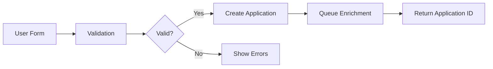
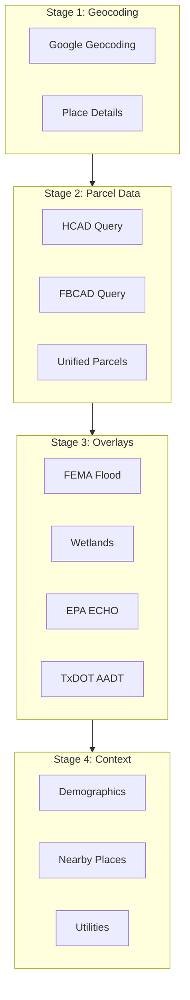
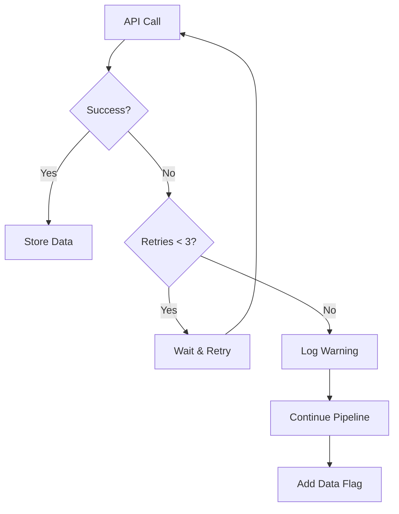
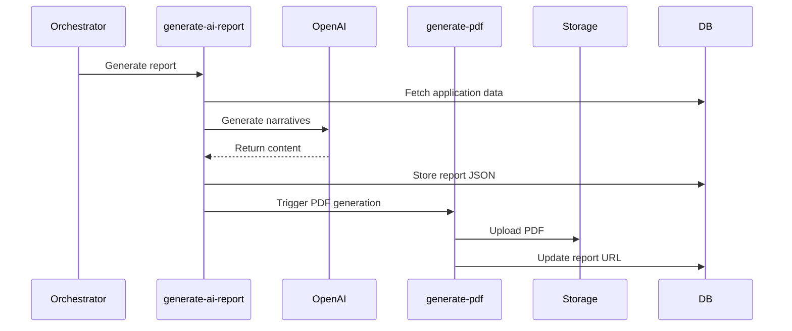
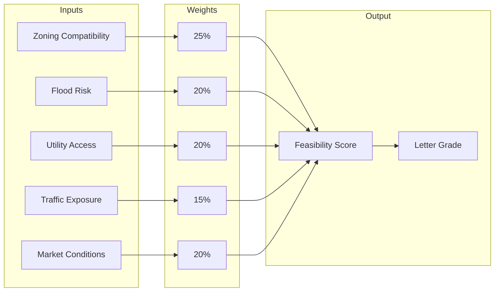
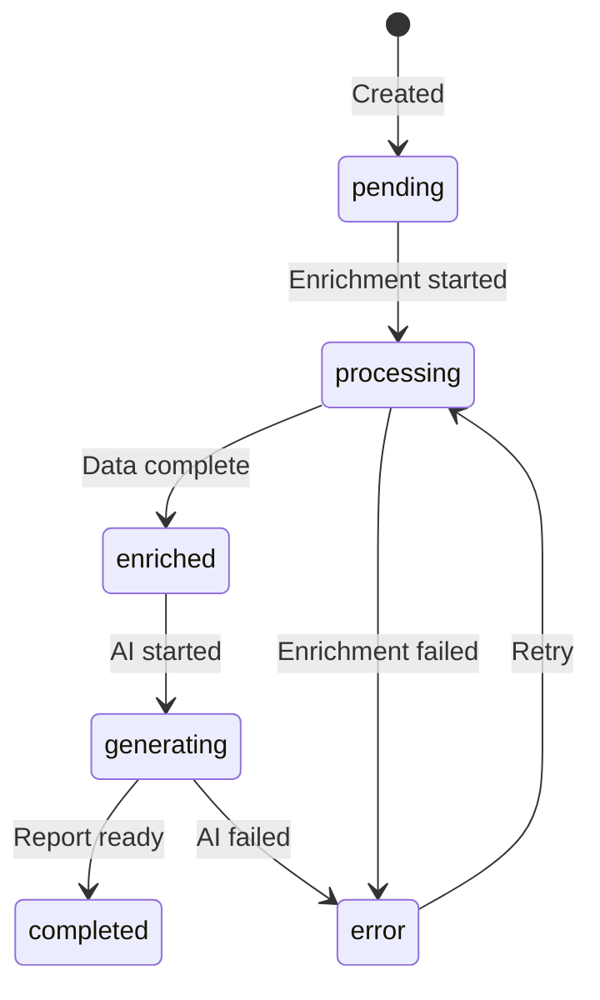

# Data Flow Documentation

Detailed documentation of data pipelines in SiteIntel™ Feasibility.

## Overview

Data flows through three main pipelines:
1. **Application Intake** → Data collection and validation
2. **Enrichment Pipeline** → External API data aggregation
3. **Report Generation** → AI analysis and PDF creation

## 1. Application Intake Flow

### User Submission



### Data Model

```typescript
interface ApplicationInput {
  // Contact Information
  full_name: string;
  email: string;
  phone: string;
  company: string;
  
  // Property Details
  property_address: {
    street: string;
    city: string;
    state: string;
    zip: string;
  };
  lot_size_value: number;
  lot_size_unit: 'acres' | 'sqft';
  existing_improvements: string;
  ownership_status: 'own' | 'contract' | 'looking';
  
  // Project Intent
  project_type: string[];
  intent_type: 'build' | 'buy' | 'sell';
  quality_level: 'standard' | 'professional' | 'premium';
}
```

### Processing Steps

1. **Frontend Validation**
   - Required fields check
   - Format validation (email, phone)
   - Address completeness

2. **Edge Function Processing**
   ```typescript
   // submit-application/index.ts
   const { data: application } = await supabase
     .from('applications')
     .insert({
       ...input,
       status: 'pending',
       enrichment_status: 'queued',
       user_id: user.id,
     })
     .select()
     .single();
   ```

3. **Orchestration Trigger**
   ```typescript
   await supabase.functions.invoke('orchestrate-application', {
     body: { applicationId: application.id }
   });
   ```

## 2. Enrichment Pipeline

### Pipeline Architecture



### Enrichment Functions

| Function | Data Source | Output Fields |
|----------|-------------|---------------|
| `geocode-intersection` | Google Geocoding | `geo_lat`, `geo_lng`, `formatted_address` |
| `fetch-hcad-parcels` | HCAD/FBCAD ArcGIS | `parcel_id`, `acreage_cad`, `parcel_owner` |
| `query-fema-by-point` | OpenFEMA | `floodplain_zone`, `base_flood_elevation` |
| `enrich-wetlands` | USFWS NWI | `wetlands_type`, `wetlands_area_pct` |
| `enrich-epa-echo` | EPA ECHO | `epa_facilities_count`, `nearest_facility_dist` |
| `enrich-utilities` | City GIS | `water_lines`, `sewer_lines`, `storm_lines` |
| `fetch-drivetimes` | Google Distance | `drivetimes`, `drive_time_*_population` |

### Error Handling Strategy



### Data Flags

When data sources fail, flags are added for transparency:

```typescript
interface DataFlags {
  FEMA_API_UNAVAILABLE?: boolean;
  EPA_TIMEOUT?: boolean;
  PARCEL_NOT_FOUND?: boolean;
  WETLANDS_QUERY_FAILED?: boolean;
  // ...
}
```

## 3. Report Generation Flow

### AI Report Pipeline



### Report Sections

```typescript
interface ReportOutput {
  executive_summary_output: string;
  property_overview_output: string;
  zoning_output: string;
  utilities_output: string;
  traffic_output: string;
  market_output: string;
  costs_output: string;
  schedule_output: string;
  highest_best_use_output: string;
  conclusion_output: string;
}
```

### Scoring Algorithm



### Grade Mapping

| Score Range | Grade | Interpretation |
|-------------|-------|----------------|
| 90-100 | A | Excellent feasibility |
| 80-89 | B | Good feasibility |
| 70-79 | C | Moderate feasibility |
| 60-69 | D | Limited feasibility |
| 0-59 | F | Poor feasibility |

## 4. Real-time Updates

### Status Broadcasting

```typescript
// Using Supabase Realtime
const channel = supabase
  .channel('application-updates')
  .on(
    'postgres_changes',
    {
      event: 'UPDATE',
      schema: 'public',
      table: 'applications',
      filter: `id=eq.${applicationId}`,
    },
    (payload) => {
      setStatus(payload.new.status);
      setProgress(payload.new.status_percent);
    }
  )
  .subscribe();
```

### Status Transitions



## 5. Caching Strategy

### Cache Layers

| Layer | Implementation | TTL |
|-------|----------------|-----|
| Browser | TanStack Query | 5 min |
| Application | Supabase `cache_expires_at` | Variable |
| Database | Materialized views | On demand |

### Cache Invalidation

```typescript
// Invalidate on data update
await queryClient.invalidateQueries({
  queryKey: ['application', applicationId],
});

// Prefetch related data
await queryClient.prefetchQuery({
  queryKey: ['report', applicationId],
  queryFn: () => fetchReport(applicationId),
});
```

---

**Next**: [Database Schema →](./database-schema.md)
