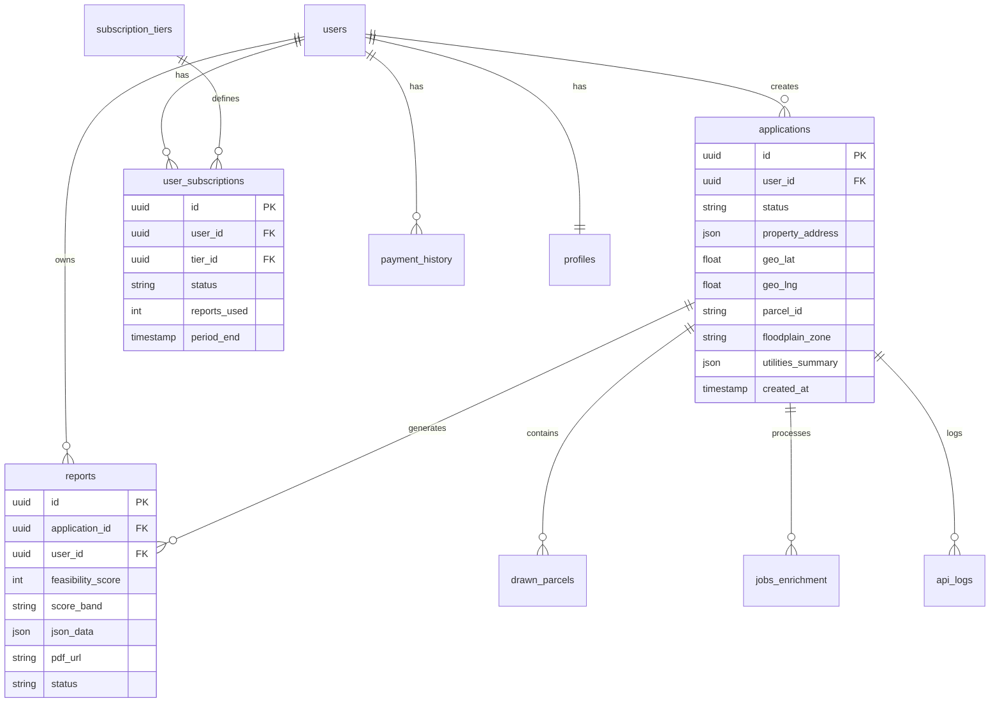

# Database Schema

Complete reference for the SiteIntel™ PostgreSQL database schema.

## Overview

The database uses PostgreSQL with PostGIS extension for spatial data support. All tables have Row-Level Security (RLS) enabled.

## Entity Relationship Diagram



## Core Tables

### applications

Primary table for feasibility analysis requests.

```sql
CREATE TABLE applications (
    id UUID PRIMARY KEY DEFAULT gen_random_uuid(),
    user_id UUID NOT NULL REFERENCES auth.users(id),
    
    -- Contact Info
    full_name TEXT NOT NULL,
    email TEXT NOT NULL,
    phone TEXT NOT NULL,
    company TEXT NOT NULL,
    
    -- Property Details
    property_address JSONB,
    formatted_address TEXT,
    geo_lat DOUBLE PRECISION,
    geo_lng DOUBLE PRECISION,
    lot_size_value NUMERIC,
    lot_size_unit TEXT,
    
    -- Parcel Data
    parcel_id TEXT,
    parcel_owner TEXT,
    acreage_cad NUMERIC,
    acct_num TEXT,
    
    -- Zoning
    zoning_code TEXT,
    land_use_code TEXT,
    overlay_district TEXT,
    
    -- Environmental
    floodplain_zone TEXT,
    base_flood_elevation NUMERIC,
    wetlands_type TEXT,
    wetlands_area_pct NUMERIC,
    
    -- Utilities
    water_lines JSONB,
    sewer_lines JSONB,
    storm_lines JSONB,
    utilities_summary JSONB,
    
    -- Traffic
    traffic_aadt INTEGER,
    traffic_road_name TEXT,
    traffic_distance_ft NUMERIC,
    
    -- Demographics
    population_1mi INTEGER,
    population_3mi INTEGER,
    population_5mi INTEGER,
    median_income NUMERIC,
    
    -- Status
    status TEXT DEFAULT 'pending',
    enrichment_status TEXT DEFAULT 'queued',
    status_percent INTEGER,
    
    -- AI Outputs
    executive_summary_output TEXT,
    property_overview_output TEXT,
    zoning_output TEXT,
    -- ... more output fields
    
    -- Metadata
    created_at TIMESTAMPTZ DEFAULT now(),
    updated_at TIMESTAMPTZ DEFAULT now()
);
```

### reports

Generated feasibility reports.

```sql
CREATE TABLE reports (
    id UUID PRIMARY KEY DEFAULT gen_random_uuid(),
    application_id UUID NOT NULL REFERENCES applications(id),
    user_id UUID NOT NULL,
    
    -- Report Data
    report_type TEXT NOT NULL,
    feasibility_score INTEGER,
    score_band TEXT,
    json_data JSONB,
    pdf_url TEXT,
    
    -- AI Metrics
    ai_prompt_tokens INTEGER,
    ai_completion_tokens INTEGER,
    
    -- Status
    status TEXT DEFAULT 'pending',
    validation_status TEXT,
    error_message TEXT,
    
    -- Metadata
    created_at TIMESTAMPTZ DEFAULT now(),
    updated_at TIMESTAMPTZ DEFAULT now()
);
```

### user_subscriptions

User subscription and credit tracking.

```sql
CREATE TABLE user_subscriptions (
    id UUID PRIMARY KEY DEFAULT gen_random_uuid(),
    user_id UUID NOT NULL,
    tier_id UUID NOT NULL REFERENCES subscription_tiers(id),
    
    -- Stripe
    stripe_subscription_id TEXT,
    
    -- Period
    period_start TIMESTAMPTZ DEFAULT now(),
    period_end TIMESTAMPTZ,
    
    -- Usage
    reports_used INTEGER DEFAULT 0,
    quickchecks_used INTEGER DEFAULT 0,
    
    -- Status
    status TEXT DEFAULT 'active',
    
    -- Metadata
    created_at TIMESTAMPTZ DEFAULT now(),
    updated_at TIMESTAMPTZ DEFAULT now()
);
```

### subscription_tiers

Available subscription plans.

```sql
CREATE TABLE subscription_tiers (
    id UUID PRIMARY KEY DEFAULT gen_random_uuid(),
    name TEXT NOT NULL,
    description TEXT,
    price_monthly NUMERIC NOT NULL,
    stripe_price_id TEXT,
    
    -- Limits
    reports_per_month INTEGER,
    quickchecks_unlimited BOOLEAN DEFAULT false,
    api_access BOOLEAN DEFAULT false,
    
    created_at TIMESTAMPTZ DEFAULT now()
);
```

### payment_history

Payment transaction records.

```sql
CREATE TABLE payment_history (
    id UUID PRIMARY KEY DEFAULT gen_random_uuid(),
    user_id UUID NOT NULL,
    
    -- Payment Details
    amount_cents INTEGER NOT NULL,
    currency TEXT DEFAULT 'usd',
    payment_type TEXT NOT NULL,
    product_name TEXT,
    
    -- Stripe References
    stripe_session_id TEXT,
    stripe_payment_intent_id TEXT,
    receipt_url TEXT,
    
    -- Status
    status TEXT DEFAULT 'pending',
    
    -- Metadata
    created_at TIMESTAMPTZ DEFAULT now(),
    updated_at TIMESTAMPTZ DEFAULT now()
);
```

### profiles

Extended user profile data.

```sql
CREATE TABLE profiles (
    id UUID PRIMARY KEY,
    email TEXT,
    full_name TEXT,
    company TEXT,
    phone TEXT,
    avatar_url TEXT,
    stripe_customer_id TEXT,
    created_at TIMESTAMPTZ DEFAULT now(),
    updated_at TIMESTAMPTZ DEFAULT now()
);
```

## Supporting Tables

### drawn_parcels

User-drawn parcel boundaries.

```sql
CREATE TABLE drawn_parcels (
    id UUID PRIMARY KEY DEFAULT gen_random_uuid(),
    user_id UUID NOT NULL,
    application_id UUID REFERENCES applications(id),
    name TEXT NOT NULL,
    geometry GEOMETRY(Polygon, 4326) NOT NULL,
    acreage_calc NUMERIC,
    source TEXT,
    created_at TIMESTAMPTZ DEFAULT now(),
    updated_at TIMESTAMPTZ DEFAULT now()
);
```

### api_logs

External API call logging.

```sql
CREATE TABLE api_logs (
    id UUID PRIMARY KEY DEFAULT gen_random_uuid(),
    application_id UUID REFERENCES applications(id),
    source TEXT NOT NULL,
    endpoint TEXT NOT NULL,
    duration_ms INTEGER NOT NULL,
    success BOOLEAN NOT NULL,
    error_message TEXT,
    cache_key TEXT,
    expires_at TIMESTAMPTZ,
    timestamp TIMESTAMPTZ DEFAULT now()
);
```

### jobs_enrichment

Background job tracking.

```sql
CREATE TABLE jobs_enrichment (
    id SERIAL PRIMARY KEY,
    application_id UUID NOT NULL REFERENCES applications(id),
    job_status TEXT DEFAULT 'queued',
    started_at TIMESTAMPTZ,
    finished_at TIMESTAMPTZ,
    error_message TEXT,
    provider_calls JSONB
);
```

## Geospatial Tables

### fema_flood_zones

Cached FEMA flood zone data.

```sql
CREATE TABLE fema_flood_zones (
    id UUID PRIMARY KEY DEFAULT gen_random_uuid(),
    fema_id TEXT NOT NULL,
    zone TEXT,
    geometry JSONB NOT NULL,
    source TEXT NOT NULL,
    created_at TIMESTAMPTZ DEFAULT now(),
    updated_at TIMESTAMPTZ DEFAULT now()
);
```

### txdot_traffic_segments

Cached TxDOT traffic data.

```sql
CREATE TABLE txdot_traffic_segments (
    id UUID PRIMARY KEY DEFAULT gen_random_uuid(),
    segment_id TEXT NOT NULL,
    roadway TEXT,
    aadt INTEGER,
    year INTEGER,
    geometry JSONB NOT NULL,
    source TEXT NOT NULL,
    created_at TIMESTAMPTZ DEFAULT now(),
    updated_at TIMESTAMPTZ DEFAULT now()
);
```

## Views

### v_parcels

Simplified parcel view.

```sql
CREATE VIEW v_parcels AS
SELECT
    id AS application_id,
    parcel_id,
    formatted_address,
    geo_lat,
    geo_lng,
    city,
    county,
    acreage_cad,
    lot_size_value,
    lot_size_unit,
    zoning_code,
    ownership_status,
    existing_improvements,
    elevation,
    overlay_district,
    neighborhood,
    property_address,
    created_at,
    updated_at
FROM applications;
```

### v_reports_public

Public report view (sanitized).

```sql
CREATE VIEW v_reports_public AS
SELECT
    r.id,
    r.application_id,
    r.user_id,
    r.feasibility_score,
    r.score_band,
    r.report_type,
    r.pdf_url,
    r.status,
    r.json_data,
    a.formatted_address,
    a.city,
    a.county,
    a.zoning_code,
    a.lot_size_value,
    a.lot_size_unit,
    a.intent_type,
    r.created_at,
    r.updated_at
FROM reports r
JOIN applications a ON r.application_id = a.id;
```

## Indexes

```sql
-- Applications
CREATE INDEX idx_applications_user_id ON applications(user_id);
CREATE INDEX idx_applications_status ON applications(status);
CREATE INDEX idx_applications_created_at ON applications(created_at DESC);
CREATE INDEX idx_applications_geo ON applications USING GIST (
    ST_SetSRID(ST_MakePoint(geo_lng, geo_lat), 4326)
);

-- Reports
CREATE INDEX idx_reports_application_id ON reports(application_id);
CREATE INDEX idx_reports_user_id ON reports(user_id);

-- Subscriptions
CREATE INDEX idx_user_subscriptions_user_id ON user_subscriptions(user_id);

-- Drawn Parcels
CREATE INDEX idx_drawn_parcels_geometry ON drawn_parcels USING GIST(geometry);
```

## Functions

### calculate_acreage

Calculate acreage from geometry.

```sql
CREATE OR REPLACE FUNCTION calculate_acreage(geom geometry)
RETURNS numeric AS $$
BEGIN
    RETURN ST_Area(geom::geography) / 4046.8564224;
END;
$$ LANGUAGE plpgsql IMMUTABLE;
```

---

**Next**: [Edge Functions Reference →](../api/edge-functions.md)
