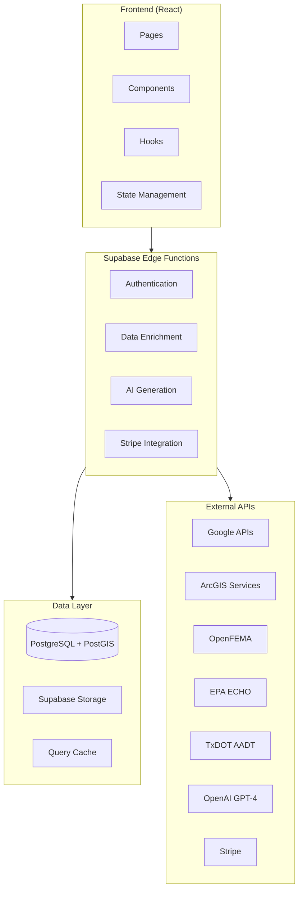
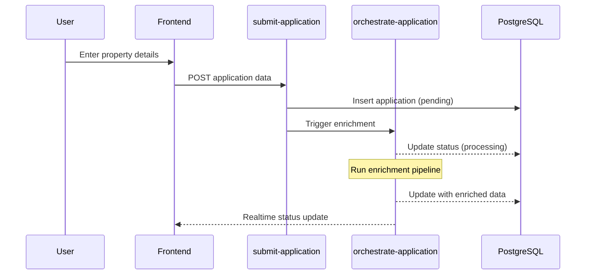
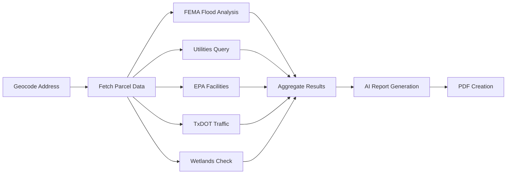
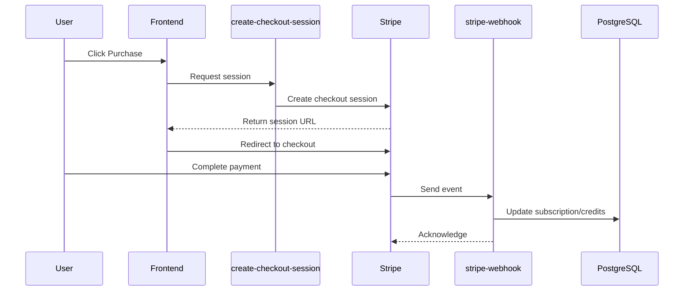
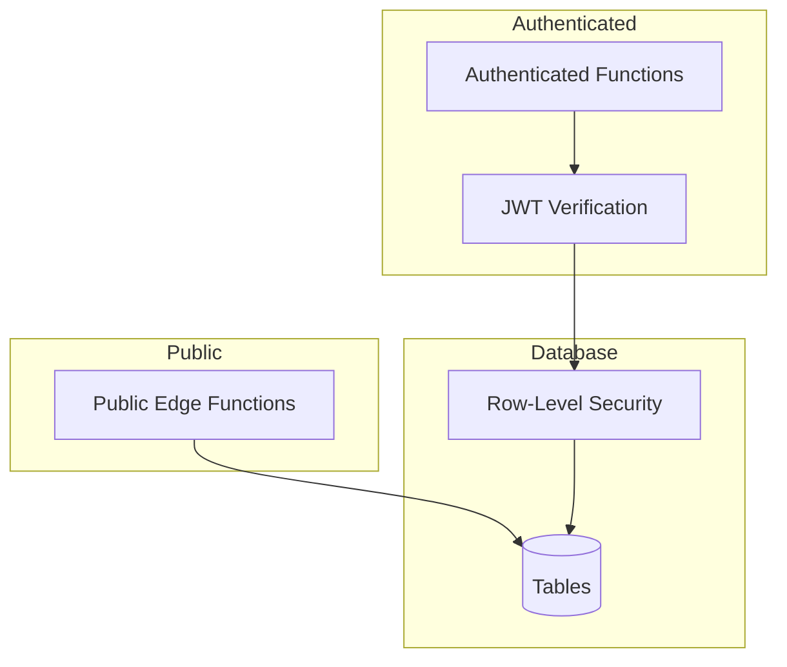

# Architecture Overview

SiteIntel™ Feasibility is a full-stack AI/GIS SaaS platform for commercial real estate feasibility analysis.

## System Architecture



## Layer Responsibilities

### Frontend Layer

| Component | Responsibility |
|-----------|----------------|
| **Pages** | Route-level components, page layouts |
| **Components** | Reusable UI components |
| **Hooks** | Data fetching, state logic, side effects |
| **State** | Global state (Zustand), server state (TanStack Query) |

**Key Technologies:**
- React 18 with TypeScript
- Vite for bundling
- Tailwind CSS + shadcn/ui
- MapLibre GL for mapping
- TanStack Query for data fetching

### Edge Layer

| Function Type | Purpose |
|---------------|---------|
| **Orchestration** | Coordinate multi-step workflows |
| **Enrichment** | Fetch and normalize external data |
| **AI Generation** | Generate narratives and scores |
| **Payments** | Stripe checkout and webhooks |
| **Utilities** | Geocoding, validation, helpers |

**Key Technologies:**
- Deno runtime
- Supabase Edge Functions
- JWT authentication

### Data Layer

| Component | Purpose |
|-----------|---------|
| **PostgreSQL** | Primary data store |
| **PostGIS** | Spatial queries and geometry |
| **Storage** | PDF reports, images |
| **RLS** | Row-level security policies |

## Core Data Flows

### 1. Application Intake



### 2. Data Enrichment Pipeline



### 3. Payment Flow



## Module Breakdown

### Frontend Modules

```
src/
├── components/
│   ├── ui/              # shadcn/ui primitives
│   ├── navigation/      # Header, Footer, Sidebar
│   ├── sections/        # Homepage sections
│   └── beta/            # Beta feature components
├── pages/
│   ├── Index.tsx        # Homepage
│   ├── Dashboard.tsx    # User dashboard
│   ├── ReportViewer.tsx # Report display
│   └── Pricing.tsx      # Pricing page
├── hooks/
│   ├── useApplicationForm.ts
│   ├── useMapLayers.ts
│   └── useAdminRole.ts
└── contexts/
    └── SubscriptionContext.tsx
```

### Edge Function Modules

```
supabase/functions/
├── orchestrate-application/   # Main workflow orchestrator
├── enrich-*/                  # Data enrichment functions
│   ├── enrich-feasibility/
│   ├── enrich-utilities/
│   ├── enrich-wetlands/
│   └── enrich-epa-echo/
├── generate-*/                # Report generation
│   ├── generate-ai-report/
│   ├── generate-pdf/
│   └── generate-quick-check/
├── stripe-*/                  # Payment functions
│   ├── create-checkout-session/
│   ├── stripe-webhook/
│   └── customer-portal/
└── utility functions/         # Helpers
    ├── geocode-intersection/
    ├── fetch-hcad-parcels/
    └── query-fema-by-point/
```

## Security Architecture



### Security Layers

1. **Edge Function Layer**: JWT verification for authenticated routes
2. **Database Layer**: RLS policies enforce user-level access
3. **API Layer**: Input validation and sanitization
4. **Transport Layer**: HTTPS/TLS encryption

## Performance Considerations

### Caching Strategy

| Data Type | Cache Duration | Strategy |
|-----------|----------------|----------|
| Parcel data | 30 days | Database cache |
| FEMA flood zones | 90 days | Database cache |
| Traffic counts | 365 days | Database cache |
| API responses | 5 minutes | TanStack Query |

### Optimization Techniques

- **Lazy loading**: Route-based code splitting
- **Pagination**: Large data sets paginated
- **Spatial indexes**: PostGIS GIST indexes
- **Query optimization**: Selective field fetching

## Scalability

### Horizontal Scaling

- Edge functions scale automatically
- Database can upgrade to larger instances
- Storage scales with Supabase

### Vertical Scaling

- Upgrade Supabase compute instance
- Add read replicas for heavy read workloads
- Implement connection pooling

---

**Next**: [Data Flow →](./data-flow.md)
