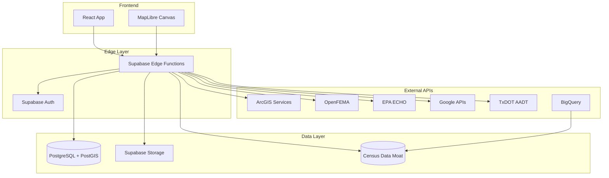

# SiteIntel™ Feasibility Documentation

Welcome to the SiteIntel™ Feasibility platform documentation. This guide will help you understand, develop, and deploy the AI-powered commercial real estate feasibility analysis system.

## Quick Links

| Section | Description |
|---------|-------------|
| [Quickstart Guide](./guides/quickstart.md) | Get up and running in 5 minutes |
| [Environment Setup](./guides/environment-setup.md) | Configure your development environment |
| [Architecture Overview](./architecture/overview.md) | System design and components |
| [Census Data Moat](./architecture/CENSUS_DATA_MOAT.md) | Proprietary demographics infrastructure |
| [Edge Functions Index](./api/EDGE_FUNCTIONS_INDEX.md) | Complete API reference |
| [Database Schema](./architecture/database-schema.md) | Data models and relationships |

## What is SiteIntel™?

SiteIntel™ Feasibility is an AI/GIS SaaS platform that transforms commercial real estate due diligence from weeks of manual analysis into minutes of automated intelligence. The platform generates lender-ready feasibility reports by aggregating data from:

- **County Appraisal Districts** (HCAD, FBCAD, MCAD)
- **FEMA Flood Data** (NFHL, OpenFEMA)
- **TxDOT Traffic Counts** (AADT)
- **EPA Environmental Data** (ECHO facilities)
- **USFWS Wetlands Inventory** (NWI)
- **Google Places & Geocoding**
- **Census Data Moat** (Proprietary BigQuery-powered demographics)

## Platform Architecture



## Key Features

### 🗺️ Geospatial Intelligence
- Parcel boundary detection
- Flood zone overlay analysis
- Wetlands identification
- Traffic exposure scoring

### 🤖 AI-Powered Analysis
- GPT-4 narrative generation
- Feasibility scoring (A-F grades)
- Risk assessment
- Market context analysis

### 📊 Census Data Moat
- 83+ ACS demographic variables
- 6 proprietary CRE indices
- Sub-50ms spatial lookups
- Zero Census API dependencies

### 📋 Lender-Ready Reports
- Professional PDF generation
- Data citations and timestamps
- Compliance-ready formatting
- Downloadable assets

### 💳 Flexible Pricing
- Free QuickCheck analysis
- Pay-per-report ($795)
- Pro subscription ($1,950/mo)

## Documentation Structure

```
docs/
├── index.md                    # This file
├── guides/
│   ├── quickstart.md          # Getting started
│   ├── environment-setup.md   # Dev environment
│   └── deployment.md          # Deployment guide
├── api/
│   ├── EDGE_FUNCTIONS_INDEX.md # Complete API reference
│   ├── edge-functions.md      # Legacy API docs
│   └── external-integrations.md # External API docs
├── architecture/
│   ├── overview.md            # System architecture
│   ├── CENSUS_DATA_MOAT.md    # Demographics infrastructure
│   ├── CANONICAL_SCHEMA.md    # Data model
│   ├── data-flow.md           # Data pipeline
│   └── database-schema.md     # Database design
├── features/
│   ├── DEMOGRAPHICS_ENRICHMENT.md # Demographics pipeline
│   ├── REPORT_GENERATION.md   # Report generation
│   └── PDF_GENERATION.md      # PDF pipeline
├── migrations/
│   └── CENSUS_MOAT_MIGRATION.md # Census migrations
└── security/
    └── rls-policies.md        # Row-level security
```

## Tech Stack

| Layer | Technology |
|-------|------------|
| Frontend | React 18, TypeScript, Vite |
| Styling | Tailwind CSS, shadcn/ui |
| State | TanStack Query, Zustand |
| Maps | MapLibre GL |
| Backend | Supabase Edge Functions (Deno) |
| Database | PostgreSQL + PostGIS |
| Auth | Supabase Auth |
| Payments | Stripe |
| AI | OpenAI GPT-4 |
| Demographics | BigQuery (Census ACS) |

## Required Secrets

| Secret | Description |
|--------|-------------|
| `OPENAI_API_KEY` | OpenAI API for GPT-4 |
| `GOOGLE_MAPS_API_KEY` | Google Maps/Places |
| `STRIPE_SECRET_KEY` | Stripe payments |
| `STRIPE_WEBHOOK_SECRET` | Stripe webhooks |
| `PDFSHIFT_API_KEY` | PDF generation |
| `BIGQUERY_SERVICE_ACCOUNT_KEY` | Census Data Moat |

## Getting Help

- **Documentation Issues**: Open an issue on GitHub
- **Feature Requests**: Use GitHub Discussions
- **Security Concerns**: Email security@siteintel.dev
- **Support**: support@siteintel.dev

---

**Next**: [Quickstart Guide →](./guides/quickstart.md)
